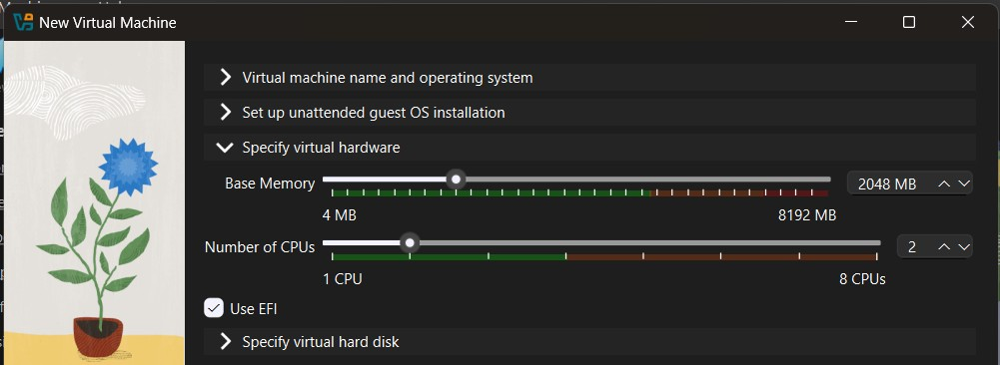
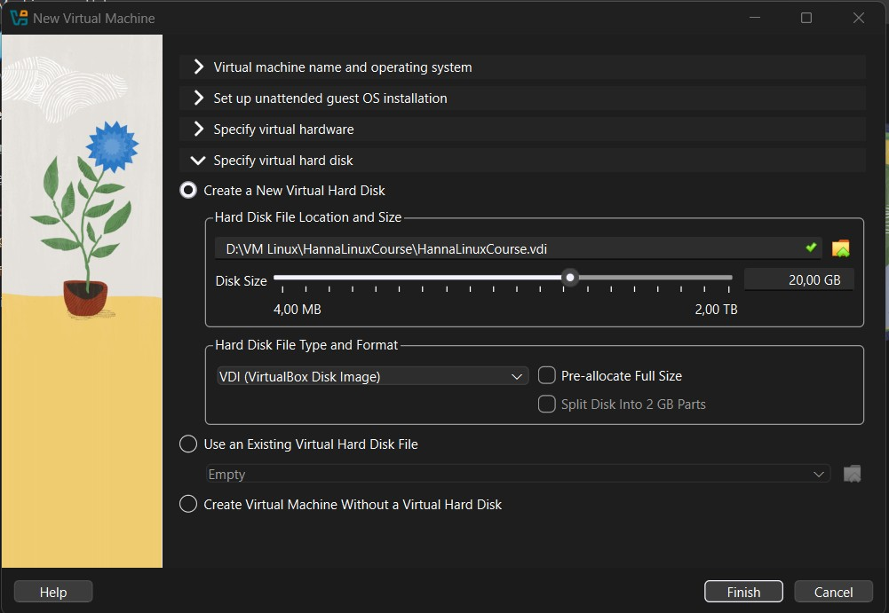
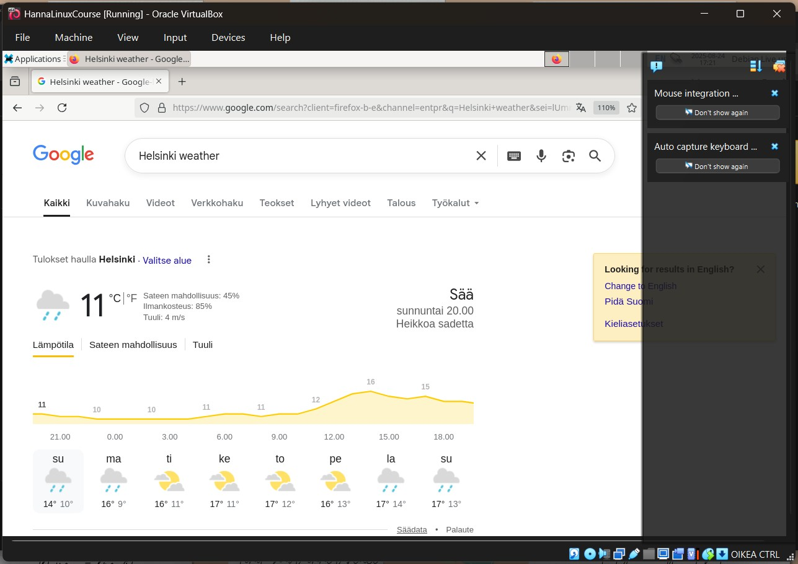
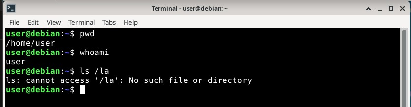

# H1 Oma Linux

## Tiivistelmä raportin kirjoittamisesta

- Kirjoita raporttia samaan aikaan, kun teet asiaa.
- **Toistettava**: Raportoi ympäristö, eli milloin teit harjoituksen, missä ja mitä konetta käytit.
- **Täsmällinen**: Minkä komennon annoit, mitä klikkasit (ilmoita myös kellonajat)? Mitä tämän jälkeen tapahtui? Onnistuiko vai ei, miten sen totesit? Raportoi tulokset menneessä muodossa.
- **Helppolukuinen**: Käytä väliotsikoita ja kirjoita huolellista kieltä. Loppuun voi kirjoittaa lyhyen tiivistelmän.
- **Viittaa lähteisiin, Vakiotekstejä**: Käytä viittauksia tekstissä.
- **Pahoja mokia**: Kirjoita vain sellaista, mitä olet tehnyt. Älä plagioi tekstiä äläkä kuvia.

## Linuxin asentaminen virtuaalikoneeseen

Tein harjoituksen sunnuntaina 24.8.2025 Helsingissä kotona. Koneena oli HP Laptop 14-cf1006no, jossa käyttöjärjestelmänä Windows 11 Home.

- klo 19.25 Olin ladannut VirtualBoxin aikaisemmin koneelleni, joten menin suoraan lataamaan virtuaalikoneella tarvittavan ISO-tiedoston. Menin Chrome-selaimella osoitteeseen https://cdimage.debian.org/debian-cd/13.0.0-live/amd64/iso-hybrid/, josta latasin ISO-tiedoston nimeltään debian-live-13.0.0-amd64-xfce.iso. 
- 19.50 ISO-tiedoston lataus oli valmis. Avasin koneellani olevan VirtualBoxin.

Uuden virtuaalikoneen tekeminen

- 19.53 Rupesin tekemään uutta virtuaalikonetta klikkaamalla VirtualBoxin etusivulla olevaa New-painiketta.
- 19.55 Annoin uudelle virtuaalikoneelle erilaisia tietoja. Alla olevassa kuvassa anoin virtuaalikoneelle nimen, tallennuspaikan, ISO-tiedoston sijainnin ja käyttöjärjestelmän (OS). Huomasin, että jos "Proceed with Unattended Installation" -kohta oli täpätty, virtuaalikoneen OS:n versiota ei voinut muuttaa 32:sta 64:ään, joten jätin sen täppäämättä. Laitoin oman VM folderin D-asemalle, koska C-asemani on jonkin verran täynnä.

- 20.03 Määritin muistin koon ja CPU:n määrän, alla kuva.

- 20.04 Määritin vielä kovalevyn koon, alla kuva.

- 20.07 Kun olin määrittänyt vaadittavat parametrit uudelle virtuaalikoneelle, klikkasin Finish-painiketta. Tällöin uusi virtuaalikone ilmestyi VirtualBoxin etusivulle.

Uuden virtuaalikoneen testaus

- 20.09 Uusi virtuaalikone näkyi VirtualBoxin vasemmassa palkissa ja siihen liittyvät tiedot oikealla. Klikkasin virtuaalikonetta hiiren oikealla painikkeella, joka avasi valikon. Valitsin valikosta Start ja Start with GUI. Virtuaalikone rupesi käynnistymään (Powering up) ja se käynnistyi uuteen ikkunaan.
- 20:13 Virtuaalikoneen näytölle avautui "Live Boot Menu with GRUB". Tässä oli eri vaihtoehtoja, joista valmiiksi valittuna oli "Live system (amd64)". Hyväksyin sen enterillä.
- 20:16 Valitsin hiirellä ikkunan yläkulmasta Application ja sieltä Web browser, jolla sain auki Firefox-selaimen. Hain "Helsinki sää", mutta koska en saanut ääkkösiä toimimaan, niin kirjoitinkin Firefoxin hakupalkkiin "Helsinki weather". Haki Helsingin sään (alla kuva), joten Internet toimii. Suljin Firefoxin klikkaamalla Firefoxin yläpalkkia hiiren oikealla ja valitsemalla Close.
  

- 20:22 Avasin terminaalin alhaalta. Annoin siinä komennot pwd ja whoami ja näiden jälkeen vielä ls -la. Alla olevassa kuvassa näkyvät tulokset, jotka sain näillä komennoilla.

- 20:25 Koska terminaali oli jo auki, kirjoitin siihen sudo reboot ja painoin enter. Tällöin virtuaalikone sulkeutui ja avautui uudestaan "Live Boot Menu with GRUB" -ikkunaan.

Virtuaalikoneen käyttäjän  asetus
- 20:28 Menin nuolinäppäimiä käyttämällä Start instraller -kohtaan ja hyväksyin enterillä. Seuraavaksi valitsin virtuaalikoneelle parametrit ja jokaisen parametrin valinnan jälkeen laitoin continue. 
- 20:30 Valitsin kieleksi englanti. Paikkakohdassa valitsin ensin other, koska Suomea ei ollut listalla (country, territory or area), seuraavaksi Europe (Continent or region) ja lopuksi Finland (Country, territory or area). Lokaaliksi (locales) valitsin en.US.UTF-8. Näppäimistöksi valitsin Finnish.
- 20:38 Määritin verkon ja laitoin host-name:ksi linux-test ja domainiksi example.com.
- 20:40 Root passwordin jätin tyhjäksi, joten painoin vain continue. Käyttäjänimeksi annoin hanna turunen. Käyttäjänimeksi annoin hanna, jota ehdotti jo valmiiksi. Annoin salasanan.
- 20:45 Partition method -kohdassa valitsin Guided - use entire disk. Select disk to partition -kohdassa oli vain yksi vaihtoehto, "SC13 (0,0,0) (sda) - 21.5 GB ATA VBOX HARDDISK", joten valitsin sen. Partitioning scheme -kohdassa valitsin "All files in one partition (recommended for new users)". Valitsin "Finish partitioning and write changes to disk", joka oli jo valittuna, continue. Kun kysyttiin "Write the changes to disks?", valitsin "Yes", continue.
- 20:51 Rupesi lataamaan, "installing the system".
- 21:00 Latau valmis. Klikkasin Continue, jolloin uudelleenkäynnisti virtuaalikoneen. Tässä kesti pienen hetken, jonka jälkeen avasi kirjautumisikkunan. Kirjoitin käyttäjänimen ja salansanan ja kirjauduin sisään. Tämän jälkeen virtuaalikone on asennettu.
- 21.05 Suljin 

Tein uuden virtuaalikoneen, jossa on Linux-käyttöjärjestelmä. Annoin tälle virtuaalikoneelle esimerkiksi kovalevyn koon ja muut parametrit sekä kielet ja vastaavat.

Lähteet:
https://github.com/johannaheinonen/johanna-test-repo/blob/main/linux-20082025.md
https://terokarvinen.com/2021/install-debian-on-virtualbox/
