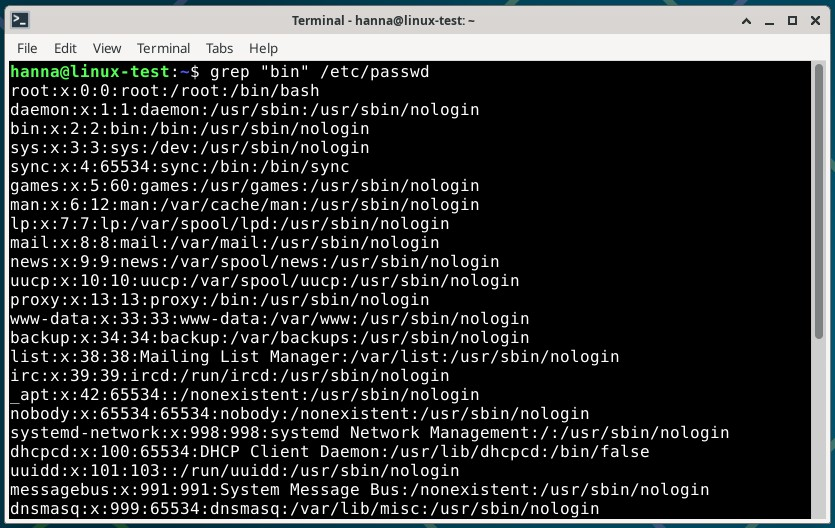

# H2 Komentaja Pingviini

## Tiivistelmä Command line basics revisited

- Komentorivi (command line) on ollut käytössä jo pitkään.
- Se on kätevä, nopea ja helppo automatisoida.
- Jos komennon jälkeen on #-merkki, loppurivi jätetään huomiotta.
- Käytössä on monia komentoja, joita kannattaa opetella ulkoa, jotta toiminta Linuxissa olisi vaivatonta. (Karvinen, 3.2.2020)

Komentoja on hyvin paljon ja varmasti kestää aikansa ennen kuin ne oppii niin, että niistä tulee automaatio. Varsinkin harvemmin käytettyjä komentoja joutuu varmasti etsimään eri hakukoneilla. 

## Tehtävät virtuaalikoneella

Tein harjoitukset torstaina 28.8.2025 ja maanantaina 1.9.2025 Helsingissä kotona. Tein torstaina harjoitukset micro-editorin asennuksesta FHS kansioiden esittelyyn (kohdat a-c) ja maanantaina grep-tehtävästä koneen raudan listaukseen (kohdat d-f). Koneena kaikissa tehtävissä oli HP Laptop 14-cf1006no, jossa käyttöjärjestelmänä on Windows 11 Home. 

### Tiivistelmä      --KESKEN

Asensin ensin micro-editorin ja sen jälkeen kolme valitsemaani komentoriviohjelmaa. Nämä olivat htop, ncdu ja cowsay. Hain neljän eri kansion tiedot. Kansiot olivat / (root), /home, /home/hanna, /etc, /media ja /var/log.

### Micro-editorin asennus

* klo 16.40 Avasin VirtualBoxin ja sieltä Linux-virtuaalikoneeni.
* 16.45 Avasin virtuaalikoneen terminaaalin. Kirjoitin komennon "apt-cache search micro", koska halusin ladata virtuaalikoneeseen micro-editorin. Tällä haulla tuli todella paljon tuloksia, joten päätin rajata hakua ja kirjoitin komentona "apt-cache search micro | grep ^micro", jolloin sain vain hieman yli 10 tulosta. Nyt löysin paljon helpommin etsimäni micro-editorin.
* 17.04 Ajoin terminaalissa komennon "sudo apt-get install micro", jonka jälkeen syötin salasanani. Hetken päästä terminaaliin tuli kysymys, että haluanko käyttää 15.0 Mb:tä levyltä, johon vastasin Y eli kyllä. Tämän jälkeen micro-editori latautui, alla kuva.

* 17.10 Micro-editori on nyt ladattu. Annoin komennon "micro", jolloin micro-editori avautui. Alla kuva micro-editorista. Suljin ohjelman komennolla ctrl+q.

### Apt, kolmen uuden komentoriviohjelman asentaminen

Hain Googlesta muutamia mahdollisia komentoriviohjelmia, koska itselläni ei ollut oikein tietoa millaisia niitä edes on olemassa. Valitsin tuloksista kaksi hyödyllisempää ohjelmaa (htop ja ncdu) ja yhden hauskan (cowsay).

* klo 18.02 Hain terminaalissa ohjelman komennolla "apt-cache search htop | grep ^htop", josta tuli tulos "htop - interactive processes viewer". Kirjoitin komennon "sudo apt-get install htop" ja annoin salasanan, kun sitä pyydettiin. Tämän jälkeen ohjelma latautui.
* 18.09 Annoin komennon "htop", jolloin htop-ohjelma avatui, kuva alla. htop-ohjelmalla voi tarkastella koneen käynnissä olevia prosesseja sekä nähdä esimerkiksi muistin tilan ja prosessorin käytön. Ohjelma on uudempi versio topista ja siinä on mukana värejä, joka tekee hahmottamisesta helpompaa (Gerardi 25.6.2025). Painamalla F10 pääsin pois ohjelmasta.

* 18.19 Kirjoitin komennon "apt-cache search ncdu | grep ^ncdu", jolloin sain tulokseksi "ncdu - ncurses disk usage viewer". Latasin tämän ohjelman komennolla "sudo apt-get install ncdu" ja latauksen alussa annoin taas salasanan.
* 18.23 Kirjoitin terminaaliin komennon "ncdu", joka avasi ohjelman. Alla kuva ohjelmasta. ncdu kertoo selkeästi ja visuaalisesti mihin levytilaa käytetään ja antaa tulokset käytetyimpien hakemistojen tai tiedostojen mukaan (Gerardi 25.6.2025). Poistuin ohjelmasta painamalla Q-näppäintä.

* 18.29 Hain kolmannen ohjelman komennolla "apt-cache search cowsay | grep ^cowsay". Tuloksia tuli kaksi, joista toinen "cowsay - configurable talking cow" oli se, jonka halusin asentaa. Annoin komennon "sudo apt-get install cowsay" ja ohjelma latatui.
* 18.34 Kirjoitin terminaaliin komennon "cowsay Hei kaikki!", josta tulostui lehmä, joka sanoi "Hei kaikki!". Alla kuva. Ohjelma tulostaa lehmän, joka sanoo kirjoittamani asian (Watkins 17.11.2021).

Olisin voinut ladata nämä kaikki samalla kertaa komennolla "sudo apt-get install htop ncdu cowsay". Tein kuitenkin jokaisen asennuksen yksitellen, jotta saisin opeteltua samalla Linuxin käyttöä.

### FHS, kansioiden esittely

* klo 19.15 Avasin terminaalin ja kirjoitin komennon "ls /". ls-komento listasi kansion sisältämät kansiot ja tiedostot ja /-komento kertoi, että haluttiin hakea juurihakemiston (root directory) kansiot ja tiedostot.
* 19.19 Seuraavaksi kirjoitin komennon "ls /home". Tämä on käyttäjän kotihakemisto ja tässä näkyi vin yksi kansio eli oma kansioni.
* 19.22 Kirjoitin komennon "ls /home/hanna", jolloin sain käyttäjän "hanna" kotihakemiston eli oma kotihakemistoni. Tänne ovoin tallentaa tiedostoja tai tehdä uusia kansioita.
* Alla kuva "ls /", "ls /home" ja "ls /home/hanna" hakujen tuloksista.

* 19.47 Kirjoitin komennon "ls /etc", joka antoi paljon tietoa. Nämä ovat järjestelmäasetukset, jotka ovat tekstitiedostoina, jolloin ihmisen on helpompaa lukea niitä. Alla kuva, jossa näkyy osa tiedostoista ja kansiosta.

  
* 19.52 Seuravaaksi kirjoitin komennon "cd /etc", jolla pääsin etc-kansioon. Ollessani etc-kansiossa annoin komennon "ls -l", jolloin näkyviin tuli tiedostojen oikeudet, omistajat, koot ja muokkauspäivät. Alla kuva osan tiedostojen tiedoista.

* 19.57 Halusin testata saisinko näkyviin pelkästään yhden tiedoston tiedot. Valitsin näkyvissä olevasta luettelosta tiedostoksi passwd-tiedoston. Annoin komennon "ls -l /etc/passwd", jolloin sain näkyviin pelkästään passwd-tiedoston tiedot. Alla kuva.

* 20.02 Menin pois etc-kansiosta antamalla komennon "cd ..". Tarkistin missä kansiossa olen antamalla "pwd"-komennon, joka kertoi, että olin  root-hakemistossa. Annoin komennon "cd /home/hanna", jotta pääsin takaisin oman hakemistooni.
* 20.06 Annoin komennon "ls /media", jolloin pääsin media-hakemistoon. Kansiossa näkyi kaksi cdrom-tulosta. Media-kansiossa näkyy nimen mukaisesti media, esimerkiksi juuri tämä näkyvä cdrom, mutta sen lisäksi voisi olla myös USB-disk.
* 20.07 Kirjoitin komennon "ls /var/log"., josta tuli esille erilaisia kansioita ja tiedostoja. Täällä kansiossa näkyy eri lokeja. Halusin katsoa lastlog-tiedoston tiedot, joten annoin komennon "ls -l /var/log/lastlog", josta tuli tämän tiedoston tiedot yhdelle riville.
* Alla kuva "ls /media" ja "ls /var/log" ja "ls -l /var/log/lastlog" komentojen tuloksista.

### The Friendly M, grep-komento     --KESKEN

* Man-komento tarkoittaa manuaalia (manual) ja sillä näytetään halutun kohteen käyttöohje (Karvinen 3.2.2020).
* Grep-komento on yksi hyödyllisimmistä komennoista Linuxissa. Sillä voidaan etsiä tiettyä sanaa, lausetta tai kuviota tekstitiedostojen sisältä ja se näyttää löydetyt tulokset ruudulla. (Geeks for Geeks 2025.)
* Komento "man grep" tarkoittaa siis, että haetaan komennolle grep käyttöohjeet.

### Pipe-esimerkki     --KESKEN

* Linuxissa |-merkkiä kutsutaan putkeksi (pipe). Sen tehtävänä on ottaa syöte edellä olevasta komennosta ja syöttää se seuraavalle. Putket ovat yksi hyödyllisimpiä ominaisuuksia Linuxissa ja niitä käytetäänkin monin eri tavoin esimerkiksi yhdistämällä useita putkia samaan komentoon (How-To Geek 2019). 

* !!!! Tein komennon "apt-cache search htop", josta tuli todella paljon rivejä. Tästä olisi ollut hyvin hankala etsiä oikeaa htop-ohjelmaa, joten käytin putkea. Annoin komennon "apt-cache search htop | grep ^htop", jolloin tulostui paljon vähemmän rivejä. Näistä on jo paljon helpompi löytää oikea ohjelma.
* !!!! Jatkoin komentoani ja halusin tietää kuinka monta riviä tulosteita tulee, jossa ensimmäisenä sanana on htop. Kirjoitin komennon "apt-cache search htop | grep ^htop | wc -l", joka näytti !!!!. wc-komento laskee rivien määrän.

* Esimerkissäni ensimmäinen komento "apt-cache search htop" etsii kaikki ne, joiden nimessä tai kuvauksessa on sana htop. Tässä tapauksessa niitä oli paljon. Ensimmäinen putki vie tämän saadun listan seuraavalle komennolle. Seuraava komento "grep ^htop" suodattaa listalta vain ne rivit, jotka alkavat sanalla htop. Toinen putki vie tämän listan seuraavalle komennolle, joka laskee rivien määrän. Koska tämä on viimeinen komento, tämä tieto tulostetaan terminaaliin. Mitään tietoa ei näytetä väleissä.

!!!!

## Lähteet

* Geeks for Geeks 2025. grep command in Unix/Linux. Luettavissa: https://www.geeksforgeeks.org/linux-unix/grep-command-in-unixlinux/. Luettu: 30.8.2025.
* Gerardi, R. 25.6.2020. 5 modern alternatives to essential Linux command-line tools. Opensource.com. Luettavissa: https://opensource.com/article/20/6/modern-linux-command-line-tools. Luettu: 28.8.2025.
* Karvinen, T. 3.2.2020. Command Line Basics Revisited. Luettavissa: https://terokarvinen.com/2020/command-line-basics-revisited/. Luettu: 28.8.2025.
* How-To Geek 2019. How to Use Pipes on Linux. Luettavissa: https://www.howtogeek.com/438882/how-to-use-pipes-on-linux/. Luettu: 30.8.2025.
* Watkins, D. 17.11.2021. 3 interesting ways to use the Linux cowsay command. Opensource.com. Luettavissa: https://opensource.com/article/21/11/linux-cowsay-command. Luettu: 28.8.2025.
* Pohjana Johanna Heinonen 2025: Linux Commands. Luettavissa: https://github.com/johannaheinonen/johanna-test-repo/blob/main/linux-27082925.md. Luettu: 28.8.2025.
* Pohjana Tero Karvinen 2025: Linux palvelimet 2025 alkusyksy. Luettavissa: https://terokarvinen.com/linux-palvelimet. Luettu: 28.9.2025.
