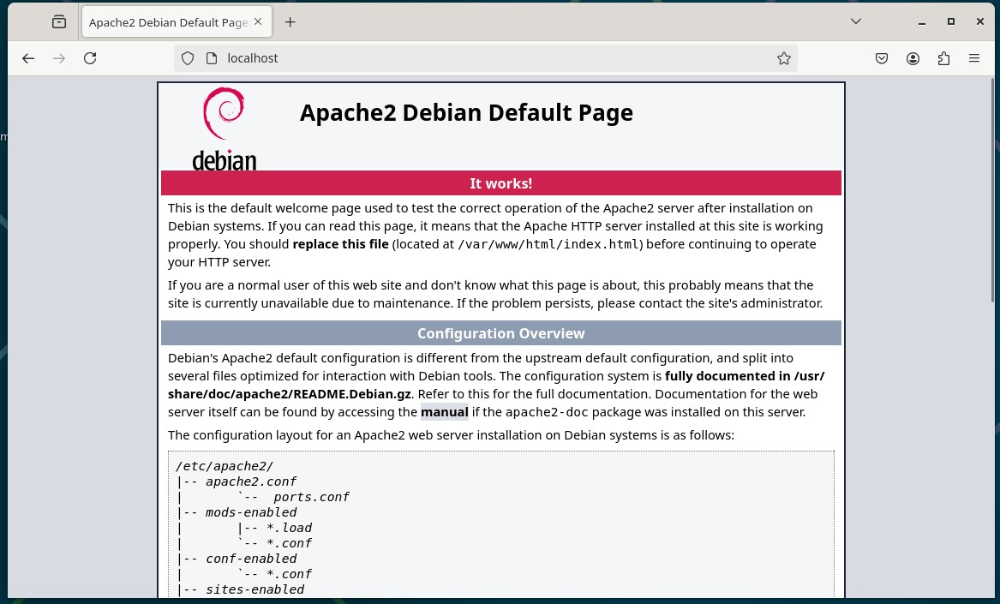
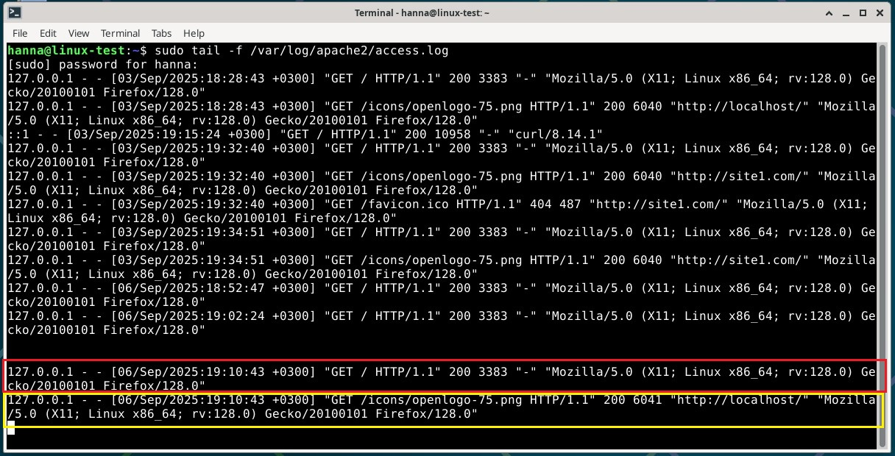
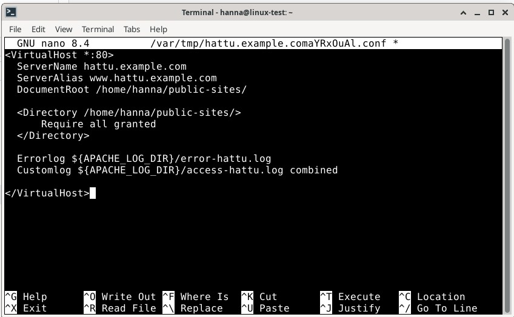
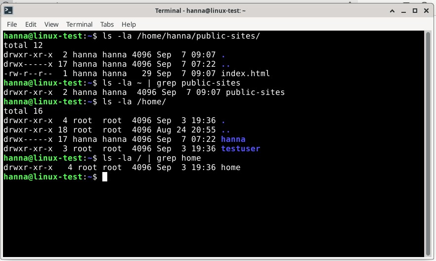
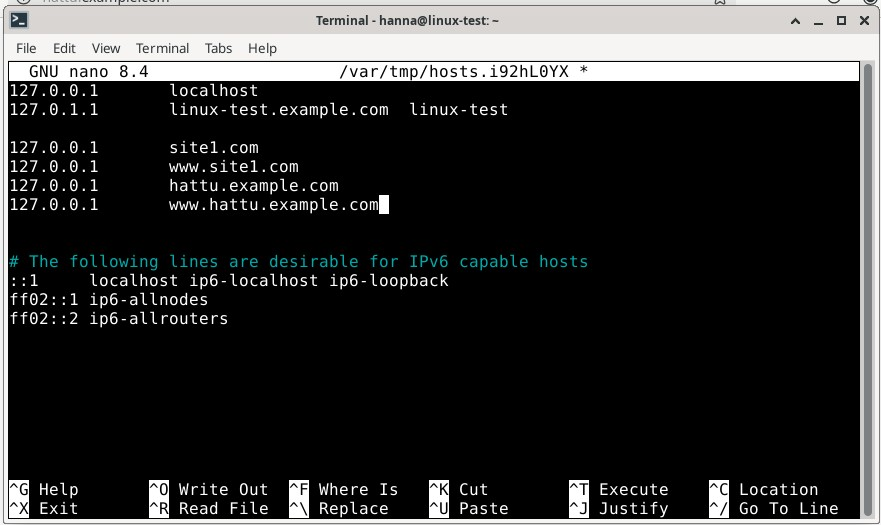
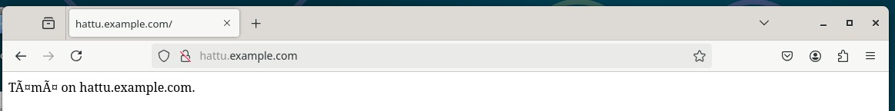
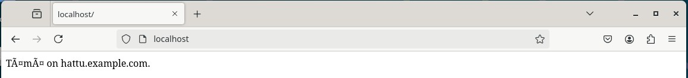
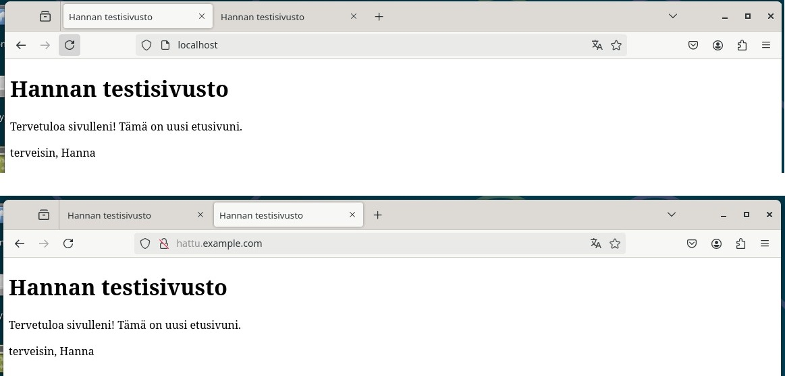
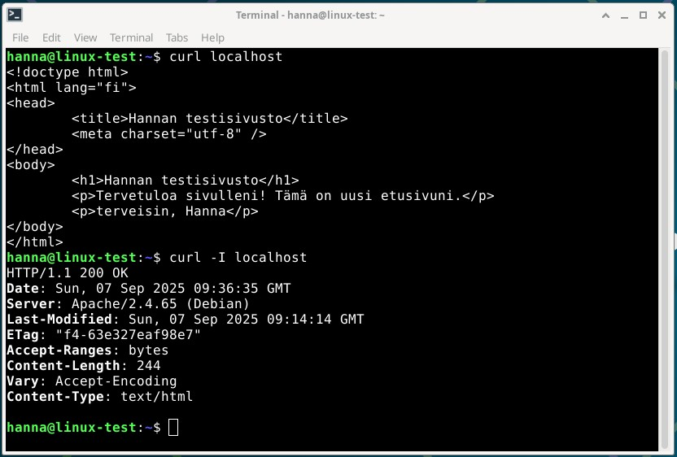

# H3 Hello Web Server

## Tiivistelmä ...KESKEN

https://httpd.apache.org/docs/2.4/vhosts/name-based.html
https://terokarvinen.com/2018/04/10/name-based-virtual-hosts-on-apache-multiple-websites-to-single-ip-address/

The Apache Software Foundation 2023: Apache HTTP Server Version 2.4 Documentation: Name-based Virtual Host Support
Karvinen 2018: Name Based Virtual Hosts on Apache – Multiple Websites to Single IP Address

## Virtuaalikonetehtävät ...KESKEN

Tein harjoitukset lauantaina 6.9.2025 ... ... Helsingissä kotona. Tein lauantaina harjoitukset Apache-webpalvelin ja lokista etsiminen, ... ... 
Koneena kaikissa tehtävissä oli HP Laptop 14-cf1006no, jossa käyttöjärjestelmänä on Windows 11 Home.

... Tiivistelmää tähän ... Apache-webpalvelin oli minulla jo asennettu. Tutustuin lokitietoihin.  

## Apache-webpalvelin

- klo 18.51 Avasin VirtualBoxissa selaimen ja menin Firefox-selaimella osoitteeseen http://localhost. Apache-sivusto avatui, alla kuva. Apache-webpalvelin on jo asennettuna.

## Lokista etsiminen

- klo 18.57 Kirjoitin terminaaliin _sudo tail -f /var/log/apache2/access.log_. Annoin salasanani ja sain listan Apache-webpalvelimen lokitiedostoista, johon on tallennettu kaikki tehdyt pyynnöt. Avasin Firefox-selaimen ja menin osoitteeseen http://localhost. Lokitiedoista analysoin kaksi alinta riviä, jotka ilmestyivät, kun avasin Firefox-selaimen ja menin localhost-sivulle. Alemmassa rivissä oli muuten samat tiedot, mutta kolme niistä oli erilaista. Kuva alempana. Tulkinnassa käytetty apuna Sumo logicin artikkelia (2025).
- Ylempi rivi, merkattu kuvaan punaisella:
    - 127.0.0.1 = kuka teki pyynnön eli IP-osoite
    - 06/Sep/2025:19:10:43 +0300 = päivämäärä, aika ja poikkeama UCTC-ajasta, kun pyyntö on tehty
    - GET /server-status HTTP/1.1 = pyyntötyyppi ja pyydetty resurssi, tässä pyydetty hakemaan serverin tila
    - 200 = HTTP:n tilakoodi
    - 3383 = asiakkaalle palautetun objektin koko
    - Mozilla/5.0 (X11; Linux x86_64; rv:129.0) Gecko/20100101 Firefox/128.0 = User Agent eli kertoo asiakkaan selaimen tiedot, tässä käytössä Mozilla Firefox
- Alempi rivi, merkattu kuvaan keltaisella:
    - muuuten samat tiedot kuin ylemmällä rivillä, mutta siitä löytyi kolme erilaista parametriä
    - GET /icons/openlogo-75.png HTTP/1.1 = pyyntötyyppi ja pyydetty resurssi, tässä pyydetty hakemaan kuvaa icons-hakemistosta
    - 6041 = asiakkaalle palautetun objektin koko
    - http://localhost/ = näyttää lähteen URL-osoitteen eli tämä oli sivu, jolle menin

## Etusivu uusiksi

- klo 8.37 Kirjoitin komennon _sudoedit /etc/apache2/sites-available/hattu.example.com.conf_, jolla pääsin muokkaamaan tiedostoa. Kopioin tiedot Johannan sivuilta (2025) ja muokkasin muutaman kohdan:
    - ServerName = hattu.example.com
    - ServerAlias = www.hattu.example.com
    - testuser = hanna
- 8.45 Tallensin muokatun tiedoston ja suljin sen.
- 8.47 Huomasin, etten muuttanut errorlogia ja customlogia. Kävin muokkaamassa ne, jonka jälkeen tallensin ja suljin tiedoston. Muokkasin:
    - Errorlog = site1:n tilalle hattu
    - Customlog = site1:n tilalle hattu

- 8.49 Kotihakemistossani on jo public-sites -hakemisto sekä kopio index.html-tiedostosta varmuuden vuoksi. Tein molemmat tunnilla.
- 8.55 Menin muokkaamaan index.html -sivua komennolla _nano /home/hanna/public-sites/index.html_. Kirjoitin tekstin, tallensin sen ja suljin editorin.
- 9.09 Tarkistin vielä sivuston oikeudet. Alla olevassa kuvassa on komennot ja niiden tulokset. Kaikki näyttää olevan kunnossa oikeuksien osalta.

- 9.14 Otin sivuston käyttöön komennolla _sudo a2ensite hattu.example.com.conf_, jonka jälkeen uudelleenlatasin Apachen komennolla _sudo systemctl reload apache2_.
- 9.18 Testasin sivuni menemällä selaimella osoitteeseen. Huomasin, ettei sivusto toiminut enkä saanut curl-komennollakaan tekstiä näkyviin, jonka olin sivulle lisännyt. Tajusin, että enhän ollut vielä lisännyt sivustolle IP-osoitetta. Lisäsin tälle uudelle sivulle IP-osoitteen. Kirjoitin komennon _sudoedit /etc/hosts_. Lisäsin hattu.example.com ja www.hattu.example.com -sivuille IP-osoitteet 127.0.0.1, alla kuva. Tallensin muutokset ja suljin editorin.

- 9.38 Tein komennot _sudo a2ensite hattu.example.com.conf_ ja _sudo systemctl reload apache2_ uudestaan. Menin selaimella hattu.example.com-sivustolle ja nyt sivusto toimi. Alla kuva. Kuitenkaan localhost-sivusto ei vielä ohjaa tähän.

- 9.44 Koska Apache ohjaa localhost-sivuston vielä default-sivustolle, poistan käytöstä default-sivun. Tein tämän komennolla _sudo a2dissite 000-default.conf_. Tämän jälkeen ajoin komennon _sudo systemctl reload apache2_. Ei toiminut vieläkään.
- 9.57 Menin muokkaamaan sivuston tietoja komennolla _sudoedit /etc/apache2/sites-available/hattu.example.com.conf_. Nyt laitoin ServerAlias-kohtaan www.hattu.example.com tilalle. Tallensin ja suljin editorin. Ajoin komennon _sudo systemctl reload apache2_. Ei vieläkään näytä selaimessa oikeaa sivustoa, mutta _curl localhost _-komennolla ja hattu.example.com näkyy oikeat.
- 10.08 Menin varmistamaan, että onhan IP-osoitteet varmasti oikein (komento _sudoedit /etc/hosts_). Osoite oli siellä, mutta poistin varmuuden vuoksi www.hattu.example.com-osoitteen. Tallensin ja suljin editorin.
- 10.13 Kävin tarkistamassa myös sivuston tiedot komennolla _sudoedit /etc/apache2/sites-available/hattu.example.com.conf_. Kaikki näytti olevan kunnossa.
- 10.15 Kävin tässä välissä katsomassa selaimella toimisiko sivusto nyt. Päivitin vielä varmuuden vuoksi sivuston ctrl-shift+r ja nyt localhost-sivustolla näkyi tekstini. Jes! Ehkä tässä kestikin vain hetken ennen kuin muutokset tulivat voimaan. Alla kuva.

## HTML5-sivun tekeminen

- klo 12.02 Menin muokkaamaan hattu.example.com-sivustoa paremmaksi komennolla _nano /home/hanna/public-sites/index.html_. Kopioin lyhyen HTML-koodin Teron sivuilta (2012) ja liitin sen editoriin. Muokkasin HTML-koodia itselleni sopivaksi. Tallensin tiedot ja suljin editorin. Kävin katsomassa miltä sivustot näyttivät nyt selaimessa ja sinne oli päivittynyt uudet tiedot. Alla kuva, jossa ylempänä on miltä teksti näyttää localhost-osoitteessa ja alempana hattu.example.com-osoitteessa. On siis täysin sama, joka pitikin olla.

## 'curl -I' ja 'curl' -komennot

- 12.27 Ajoi komennot _curl localhost_ ja _curl -I localhost_ (isolla i:llä). Ensimmäisellä komennolla tuli sivuston HTML-koodi ja toisella tiedot sivustosta. Alempana kuva. Otsakkeessa (response header) oli erilaisia tietoja, joita tarvitaan esimerkiksi selaimen käsittelyyn. Minulle tuli seuraavat tiedot:
    - HTTP/1.1 200 OK = kertoo HTTP-version ja statuskoodin, tässä pyyntö on onnistunut
    - Date = kertoo viikonpäivän, päivämäärän ja ajan
    - Server: Apache/2.4.65 (Debian) = kertoo palvelimen tiedot, tässä tapauksessa on palvelimena on Apache2 ja käyttöjärjestelmänä Debian
    - Last-Modified = milloin resurssia on muokattu
    - ETag = resurssin tunniste, tämän avulla välimuistit ovat tehokkaampia
    - Content-Lenght = lähetetyn viestin koko tavuina
    - Vary = vaikuttaa vastauksen sisältöön
    - Content-Type = lähetetyn viestin tyyppi

## Lähteet

- Karvinen, T. 12.2.2012. Short HTML5 page. Luettavissa: https://terokarvinen.com/2012/short-html5-page/. Luettu: 7.9.2025.
- MDN 2025. HTTP: Hypertext Transfer Protocol. Luettavissa: https://developer.mozilla.org/en-US/docs/Web/HTTP. Luettu: 7.9.2025.
- Sumo logic 2025. Understanding the Apache access log: how to view, locate, and analyze. Luettavissa: https://www.sumologic.com/blog/apache-access-log. Luettu: 6.9.2024.
- Pohjana Johanna Heinonen 2025: Apache2. Luettavissa: https://github.com/johannaheinonen/johanna-test-repo/blob/main/linux-03092025.md. Luettu: 6.9.2025.
- Pohjana Tero Karvinen 2025: Linux palvelimet 2025 alkusyksy. Luettavissa: https://terokarvinen.com/linux-palvelimet. Luettu: 6.9.2025.
