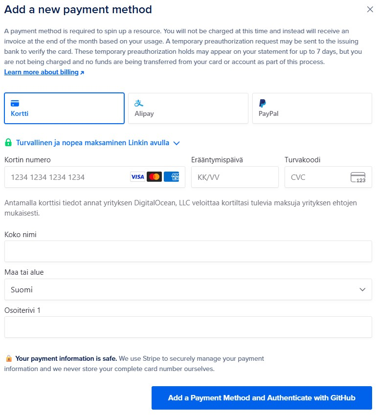
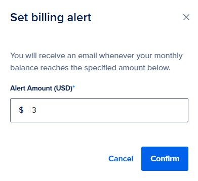
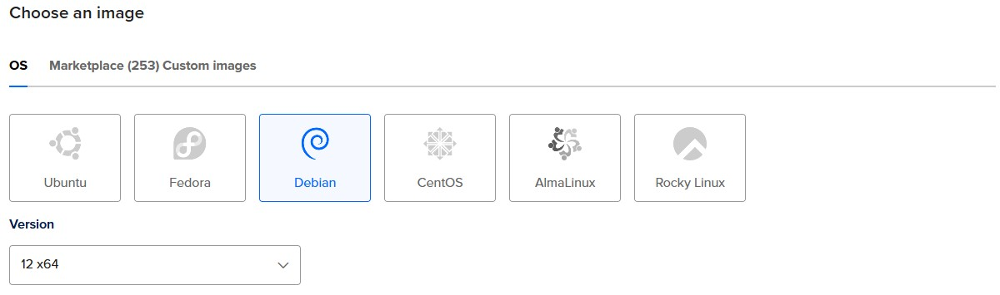
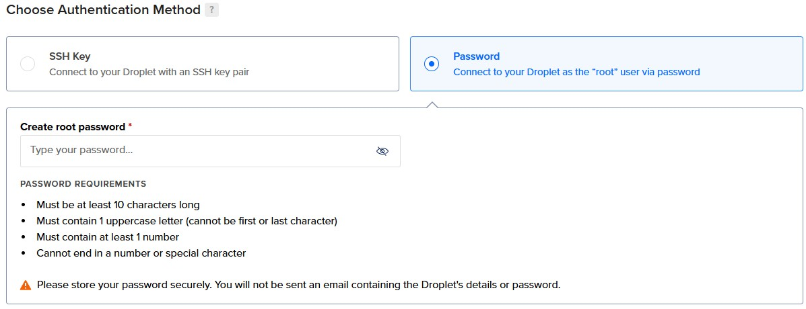

# H4 Maailman kuulee

## x) Tiivistelmät

### Susanna Lehto: Teoriasta käytäntöön pilvipalvelimen avulla (h4)

**a) Pilvipalvelimen vuokraus ja asennus**
- Lehto loi käyttäjätilin, jonka jälkeen teki virtuaalikoneen:
  - Käyttöjärjestelmä: uusin Debian
  - Virtuaalikoneen paketti: edullisin peruspaketti, koska tätä on mahdollista myöhemmin kasvattaa
  - Datakeskus: se, joka on mahdollisimman lähellä sivuston käyttäjiä. Tällöin tiedonsiirto on mahdollisimman nopeaa ja GDPR:n vaatimukset on huomioitu.
  - Autentikointi: SSH-avaimet tai salasana. SSH-avaimet on todella turvallinen vaihtoehto, mutta salasanakin on hyvä, kunhan siinä käyttää vahvaa salasanaa.
  - Lisävaihtoehdot: ei kannata ottaa, näitä ovat esimerkiksi backupit.
- Kun virtuaalikone oli vuokrattu, hän vuokrasi domainnimen Namecheapin kautta ja ohjasi domainnimen osoittamaan aiemmin hankitulle virtuaalipalvelimelle.

**d) Palvelin suojaan palomuurilla**
- Lehto ajoi komennon ```ssh root@188.166.4.6```, jotta sai yhteyden virtuaalikoneeseen.
- Haki päivitykset komennolla ```sudo apt-get update``` ja asensi palomuurin ```sudo apt-get install ufw```.
- Lopuksi teki palomuuriin reiän porttia varten komennolla ```sudo ufw allow 22/tpc``` ja laittoi palomuurin päälle ```sudo ufw enable```.

**e) Kotisivut palvelimelle**
- Lehto teki uuden käyttäjän komennolla ```sudo adduser suska``` ja tämän jälkeen teki käyttäjästä pääkäyttäjän ```sudo adduser suska sudo```.
- Avasi toisen terminaalin, jolla avasi SSH-yhteyden virtuaalipalvelimeen ```ssh suska@188.166.4.6``` ja päivitti tiedot ```sudo apt-get update```. Lopuksi lukitsi juuren ```sudo usermod –lock root```.
- Kirjautui sisään virtuaalipalvelimelle toisella terminaalilla käyttäen SSH-yhteyttä. Asensi päivitykset ja tietoturvapäivitykset komennoilla ```sudo apt-get update```, ```sudo apt-get upgrade``` ja ```sudo apt-get dist-upgrade```.
- Asensi Apach-palvelimen ```sudo apt-get install apache2```, jonka jälkeen teki toisen reiän palomuuriin toiselle portille ```sudo ufw allow 80/tcp```.
- Korvasi Apache-testisivun komennolla ```echo Hello world! |sudo tee /var/www/html/index.html```, jolla sivulle ilmestyi "Hello World!".
- Lopuksi hän loi omalle käyttäjälleen julkisen kansion kotihakemistoon ja nettisivulle lyhyen rungon W3Schools-sivujen avulla.

**f) Palvelimen ohjelmien päivitys**
- Lehto avasi terminaalin ja otti SSH-yhteyden virtuaalipalvelimelle.
- Haki tiedot päivityksistä, asensi ne ja haki myös tietoturvapäivitykset komennoilla ```sudo apt-get update```, ```sudo apt-get upgrade``` ja ```sudo apt-get dist-upgrade```.

(Lehto, 14.2.2022.)

### Tero Karvinen: First Steps on a New Virtual Private Server – an Example on DigitalOcean and Ubuntu 16.04 LTS

- Käytä aina hyviä salasanoja!
- Virtuaalisia palvelimia voi vuokrata esimerkiksi DigitalOceanilta, Linodelta ja Gandilta.
- GitHubilta saa ilmaisen Education student -paketin, jossa on virtuaalinen palvelin ja .me-domainnimen rajoitetuksi ajaksi.
- Artikkelissa ohjeistetaan miten luodaan uusi palvelin DigitalOceanille, miten palomuuriin tehdään reikä ja miten sen saa päälle, miten tehdään sudo-käyttäjä, miten root-käyttäjä suljetaan ja miten ohjelmat päivitetään. Lopuksi aletaan käyttämään luotua palvelinta. Mukana on myös komennot näihin.
- DNS-nimen voi vuokrata esimerkiksi NameCheapistä.   

(Karvinen, 19.9.2017.)

## Virtuaalikonetehtävät

Tein harjoitukset maanantaina 15.9.2025 Helsingissä kotona. Koneena kaikissa tehtävissä oli HP Laptop 14-cf1006no, jossa käyttöjärjestelmänä on Windows 11 Home.


## a) Oman virtuaalipalvelimen vuokraus DigitalOceanilta

- klo 16.05 Päätin ottaa virtuaalipalvelimen DigitalOceanilta ja hyödyntää GitHub Education -pakettia. Olin tehnyt tunnukset sinne jo tunnilla, mutta en löytänyt tätä kautta mahdollisuutta saada virtuaalipalvelinta ilmaiseksi. Hain netistä hakusanoilla "digital ocean github education", jolla pääsin sivustolle, jossa otettiin huomioon GitHubin Education -paketti. Annoin luottokorttitietoni, jolla varmistin itseni. Sain käyttöön opiskelijanpaketin, jossa on $200 vuodeksi käyttöön.

 

- 16.20 Huomasin Lehdon artikkelista, että hän oli laittanut maksuhälytykset päälle. Tämä oli mielestäni hyvä idea, joten tein itse saman. Menin _Billing_-sivustolle (valikossa vasemmalla) ja sieltä _Settings_-kohtaan. Kun selasin sivua alemmaksi, löysin kohdan _Billing Alert_. Katsoin, että halvimman virtuaalipalvelimen saa $4 kuukaudessa, joten laitoin maksurajaksi $3. Tällöin maksuraja ylittyy jokaisena kuukautena, joten muistan tarvittaessa perua tilauksen myöhemmin. Tätä voi myös tarvittaessa muuttaa, jos koenkin, että sähköposteja tulee liian paljon. Klikkasin _Confirm_.



- 16.33 Aloitin virtuaalipalvelimen luomisen. Vasemmalla olevassa valikossa näkyi _Droplet_-nappi, jota klikkasin. Näin heti paikan, josta voi alkaa luomaan virtuaalipalvelinta, joten klikkasin _Create Droplet_.


- 16.37 Valitsin virtuaalipalvelimen sijainniksi Frankfurtin, toinen vaihtoehto olisi ollut Amsterdam, jotka molemmat sijaitsevat Euroopassa. Sen lisäksi kannattaa ottaa palvelin mahdollisimman läheltä, jotta latenssi on mahdollisimman pieni.


- 16.41 Valitsin käyttöjärjestelmäksi _Debian version 12 x64_. Debianille ei ollut muita vaihtoehtoja. 



- 16.45 Valitsin prosessoriksi _Shared CPU Basic_ ja _CPU options_ -kohdasta _Regular, 512 MB / 1 CPU, 10 GB SSD Disk, 500 GB transfer_. Paketin hinta oli tällöin $4/kk ja $0.006/tunti. Tämän pitäisi riittää tälle kurssille hyvin. Aina on mahdollista pienemmästi isompaan, kun taas isommasta pienempään siirtyminen voi olla haastavampaa.  


- 16.51 _Additional Storage_- ja _Backups_-kohdat jätin tyhjäksi.


- 16.53 Valitsin autentikointitavaksi (_Authentication Method_) salasanan, koska en ole koskaan ennen käyttänyt SSH-salasanoja, vaikka näitä kannattaakin yleensä käyttää. Tein vahvan salasanan, koska aina käytetään vahvoja salasanoja. 



- 16.59 En ottanut mitään ylimääräisiä palveluja kohdasta _We recommend these options_.
- 17.05 Määränä on yksi _Droplet_ ja tagit jätin tyhjäksi. Muokkasin _Hostanme_-kohdassa palvelimen nimeksi _debian_, jolloin se on itselleni helppo löytää. _Project_-kohdassa oli _first-project_, jota ei pystynyt muuttamaan, mutta se ei haittaa, koska minulla on vain yksi projekti. Lopuksi painoin sinistä _Create droplet_ -nappia.


- 17.11 Hetken odottelun jälkeen virtuaalipalvelimeni oli valmis ja sain sille IP-osoitteen.


## b) Alkutoimet virtuaalipalvelimella: tulimuuri päälle, root-tunnus kiinni ja ohjelmien päivitys

- 17.15 Avasin VirtualBoxin ja sieltä terminaalin. Hausin ottaa yhteyden virtuaalipalvelimeeni, jonka tein komennolla ```ssh root@64.226.102.160```, jossa IP-osoite on virtuaalipalvelimeni IP-osoite. Kysyttiin haluanko ottaa yhteyden palvelimeen, johon vastasin yes. Kirjoitin vahingossa yes-sanan ensin kahdesti. Sen jälkeen annoin salasanan, jonka loin virtuaalipalvelinta tehdessä.

- ... KUVA 12 ...

- 17.22 Asensin palomuurin komennolla ```sudo apt-get install ufw``` (ylempi kuva). Tein palomuuriin reiän SSH:lle porttiin 22 komennolla ```sudo ufw allow 22/tcp``` ja laitoin lopuksi palomuurin päälle komennolla ```sudo ufw enable``` (alempi kuva). Nyt palomuuri on päällä ja virtuaalipalvelin suojattuna.

- ... KUVA 13 - 14...

- 17.29 Tein uuden käyttäjän (hannatu) komennolla ```sudo adduser hannatu```, jolle loin vahvan salasanan. Annoin nimeni ja muut kohdat jätin tyhjäksi. Sen jälkeen korotin käyttäjän pääkäyttäjäksi komennolla ```sudo adduser hannatu sudo```.

- ... KUVA 15 ...

- 17.36 Avasin toisen terminaalin ja testasin pääsenkö sisälle virtuaalipalvelimeen komennolla ```ssh hannatu@64.226.102.160```, jossa on juuri luomani käyttäjä ja virtuaalipalvelimen IP-osoite. Kysyi salasanan, jonka annoin, ja pääsin sisälle. Päivitin ohjelmat komennolla ```sudo apt-get update```. Sain ohjelmat päivitettyä, joten sain avattua SSH-yhteyden virtuaalipalvelimelleni. 

- ... KUVA 16 ...

- 17.47 Koska kaikki on kunnossa, aloitin juuren lukitsemisen. Menin takaisin toiseen terminaaliin, jossa olin root-käyttäjänä ja annoin komennon ```sudo usermod -–lock root```, jolla lukitsin root-salasanan. Tämän lisäksi estin root-käyttäjän kirjautumisen palvelimelle SSH:n kautta. Menin komennolla ```sudoedit /etc/ssh/sshd_config``` muokkaamaan tietoja. Etsin kohdan ```PermitRootLogin yes``` ja vaihdoin tämän ```PermitRootLogin no```. Tallensin muutokset tiedostoon ctrl+s ja poistuin editorista ctrl+x. Nyt root on lukittuna. Suljin yhteyden virtuaalipalvelimeen ```exit```-komennolla. Toisen terminaalin (jossa otetu SSH-yhteys hannatu-käyttäjään) on vielä auki.

- ... KUVA 17 ...

- 18.03 Ajoin vielä komennon ```sudo service ssh restart```, jotta tekemäni muutokset astuvat voimaan.
- 18.11 Menin takaisin termiinaaliin, jossa minulla oli SSH-yhteys virtuaalipalvelimeeni. Päivitin ohjelmat komennoilla ```sudo apt-get update```, ```sudo apt-get upgrade``` ja ```sudo apt-get dist-upgrade```. Päivityksen aikana tuli kysymys konfigurointitiedoista ja valitsin _Keep the local version currently installed_, koska tämä oli automaattisesti valittuna. Päivityksiin meni noin 15 minuuttia, mutta osa tästä ajasta meni konfigurointitietojen selvittämiseen.

- ... KUVA 18 ...

## c) Weppipalvelimen asentaminen virtuaalipalvelimelle. Testisivun korvaus. Kokeile, että se näkyy julkisesti, myös eri koneelta, esimerkiksi kännykältä

- 18.28 Asensin Apache2-webbipalvelimen komennolla ```sudo apt-get install apache2```, joka meni nopeasti. Testasin Apache2:n tilan komennolla ```sudo systemctl status apache2```. 

- ... KUVA 19 ...

- 18.37 Huomasin, että kello näyttää väärää, joten muokkasin ajan. Tein tämän komennolla ```sudo dpkg-reconfigure tzdata```, joka avasi ikkunan. Valitsin _Europe_ ja _Helsinki_. Kävin vielä tarkistamassa, että aika on muuttunut komennolla ```sudo systemctl status apache2``` ja se oli muuttunut. (LinuxCapable, 8.7.2024.)

- ... KUVA 20a ja b ...

- 18.53 Tein HTTP-portille reiän palomuuriin ```sudo ufw allow 80/tcp```

- ... KUVA 21 ...

- 18.58 Testasin mennä Firefox-selaimessa virtuaalipalvelimelleni ja sain Apachen-testisivun näkyviin.

- ... KUVA 22 ...

- 19.04 Korvasin testisivun komennolla ```echo It's me, hi! | sudo tee /var/www/html/index.html```, mutta jäi jumiin. Poistuin komennosta ctrl+c ja yritin uudestaan, mutta muokatulla komennolla ```echo "It's me, hi!" | sudo tee /var/www/html/index.html``` ja tällä onnistui. Potkaisin vielä demonin käyntiin komennolla ```sudo systemctl reload apache2```.

- ... KUVA 23 ...

- 19.15 Menin Firefoxilla osoitteeseen ```64.226.102.160```, jossa näkyi lisäämäni teksti, kuten myös kännykällä mentäessä. Vasemmalla kuvassa sivusto selaimessa ja oikealla kännykässä.

- ... KUVA 24a - b ...

- 19.39 Suljin yhteyden virtuaalipalvelimeen komennolla ```exit```, jonka jälkeen suljin terminaalin ja virtuaalikoneen.

## Lähteet

- Karvinen, T. 19.9.2017. First Steps on a New Virtual Private Server – an Example on DigitalOcean and Ubuntu 16.04 LTS. Luettavissa: https://terokarvinen.com/2017/first-steps-on-a-new-virtual-private-server-an-example-on-digitalocean/. Luettu: 13.9.2025.
- Lehto, S. 14.2.2022. Teoriasta käytäntöön pilvipalvelimen avulla (h4). Luettavissa: https://susannalehto.fi/2022/teoriasta-kaytantoon-pilvipalvelimen-avulla-h4/. Luettu: 13.9.2025.
- LinuxCapable 8.7.2024. How to Set Timezone on Debian 12/11/10 Linux. Luettavissa: https://wiki.debian.org/TimeZoneChanges. Luettu: 15.9.2025.
- Pohjana Tero Karvinen 2025: Linux palvelimet 2025 alkusyksy. Luettavissa: https://terokarvinen.com/linux-palvelimet. Luettu: 13.9.2025.
