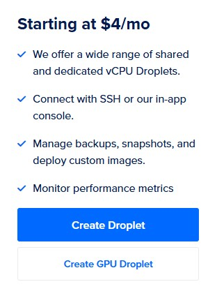
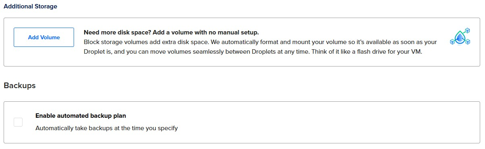

# H4 Maailman kuulee

## x) Tiivistelmät

### Susanna Lehto: Teoriasta käytäntöön pilvipalvelimen avulla (h4)

**a) Pilvipalvelimen vuokraus ja asennus**
- Lehto loi käyttäjätilin, jonka jälkeen teki virtuaalikoneen:
  - Käyttöjärjestelmä: uusin Debian
  - Virtuaalikoneen paketti: edullisin peruspaketti, koska tätä on mahdollista myöhemmin kasvattaa
  - Datakeskus: se, joka on mahdollisimman lähellä sivuston käyttäjiä. Tällöin tiedonsiirto on mahdollisimman nopeaa ja GDPR:n vaatimukset on huomioitu.
  - Autentikointi: SSH-avaimet tai salasana. SSH-avaimet on todella turvallinen vaihtoehto, mutta salasanakin on hyvä, kunhan siinä käyttää vahvaa salasanaa.
  - Lisävaihtoehdot: ei kannata ottaa, näitä ovat esimerkiksi backupit.
- Kun virtuaalikone oli vuokrattu, hän vuokrasi domainnimen Namecheapin kautta ja ohjasi domainnimen osoittamaan aiemmin hankitulle virtuaalipalvelimelle.

**d) Palvelin suojaan palomuurilla**
- Lehto ajoi komennon ```ssh root@188.166.4.6```, jotta sai yhteyden virtuaalikoneeseen.
- Haki päivitykset komennolla ```sudo apt-get update``` ja asensi palomuurin ```sudo apt-get install ufw```.
- Lopuksi teki palomuuriin reiän porttia varten komennolla ```sudo ufw allow 22/tpc``` ja laittoi palomuurin päälle ```sudo ufw enable```.

**e) Kotisivut palvelimelle**
- Lehto teki uuden käyttäjän komennolla ```sudo adduser suska``` ja tämän jälkeen teki käyttäjästä pääkäyttäjän ```sudo adduser suska sudo```.
- Avasi toisen terminaalin, jolla avasi SSH-yhteyden virtuaalipalvelimeen ```ssh suska@188.166.4.6``` ja päivitti tiedot ```sudo apt-get update```. Lopuksi lukitsi juuren ```sudo usermod –lock root```.
- Kirjautui sisään virtuaalipalvelimelle toisella terminaalilla käyttäen SSH-yhteyttä. Asensi päivitykset ja tietoturvapäivitykset komennoilla ```sudo apt-get update```, ```sudo apt-get upgrade``` ja ```sudo apt-get dist-upgrade```.
- Asensi Apach-palvelimen ```sudo apt-get install apache2```, jonka jälkeen teki toisen reiän palomuuriin toiselle portille ```sudo ufw allow 80/tcp```.
- Korvasi Apache-testisivun komennolla ```echo Hello world! |sudo tee /var/www/html/index.html```, jolla sivulle ilmestyi "Hello World!".
- Lopuksi hän loi omalle käyttäjälleen julkisen kansion kotihakemistoon ja nettisivulle lyhyen rungon W3Schools-sivujen avulla.

**f) Palvelimen ohjelmien päivitys**
- Lehto avasi terminaalin ja otti SSH-yhteyden virtuaalipalvelimelle.
- Haki tiedot päivityksistä, asensi ne ja haki myös tietoturvapäivitykset komennoilla ```sudo apt-get update```, ```sudo apt-get upgrade``` ja ```sudo apt-get dist-upgrade```.

(Lehto, 14.2.2022)

### Tero Karvinen: First Steps on a New Virtual Private Server – an Example on DigitalOcean and Ubuntu 16.04 LTS

- Käytä aina hyviä salasanoja!
- Virtuaalisia palvelimia voi vuokrata esimerkiksi DigitalOceanilta, Linodelta ja Gandilta.
- GitHubilta saa ilmaisen Education student -paketin, jossa on virtuaalinen palvelin ja .me-domainnimen rajoitetuksi ajaksi.
- Artikkelissa ohjeistetaan miten luodaan uusi palvelin DigitalOceanille, miten palomuuriin tehdään reikä ja miten sen saa päälle, miten tehdään sudo-käyttäjä, miten root-käyttäjä suljetaan ja miten ohjelmat päivitetään. Lopuksi aletaan käyttämään luotua palvelinta. Mukana on myös komennot näihin.
- DNS-nimen voi vuokrata esimerkiksi NameCheapistä.   

(Karvinen, 19.9.2017)

## Virtuaalikonetehtävät

Tein harjoitukset ... ... Helsingissä kotona. Tein ... (kohdat ...). Koneena kaikissa tehtävissä oli HP Laptop 14-cf1006no, jossa käyttöjärjestelmänä on Windows 11 Home.


## a) Oman virtuaalipalvelimen vuokraus DigitalOceanilta

- klo 16.05 Päätin ottaa virtuaalipalvelimen DigitalOceanilta ja hyödyntää GitHub Education -pakettia. Olin tehnyt tunnukset sinne jo tunnilla, mutta en löytänyt tätä kautta mahdollisuutta saada virtuaalipalvelinta ilmaiseksi. Hain netistä hakusanoilla "digital ocean github education", jolla pääsin sivustolle, jossa otettiin huomioon GitHubin Education -paketti. Annoin luottokorttitietoni, jolla varmistin itseni. Sain käyttöön opiskelijanpaketin, jossa on $200 vuodeksi käyttöön.

... KUVA 01 ja 02 ...

- 16.20 Huomasin Lehdon artikkelista, että hän oli laittanut maksuhälytykset päälle. Tämä oli mielestäni hyvä idea, joten tein itse saman. Menin _Billing_-sivustolle (valikossa vasemmalla) ja sieltä _Settings_-kohtaan. Kun selasin sivua alemmaksi, löysin kohdan _Billing Alert_. Katsoin, että halvimman virtuaalipalvelimen saa $4 kuukaudessa, joten laitoin maksurajaksi $3. Tällöin maksuraja ylittyy jokaisena kuukautena, joten muistan tarvittaessa perua tilauksen myöhemmin. Tätä voi myös tarvittaessa muuttaa, jos koenkin, että sähköposteja tulee liian paljon. Klikkasin _Confirm_.

... KUVA 03 ...

- 16.33 Aloitin virtuaalipalvelimen luomisen. Vasemmalla olevassa valikossa näkyi _Droplet_-nappi, jota klikkasin. Näin heti paikan, josta voi alkaa luomaan virtuaalipalvelinta, joten klikkasin _Create Droplet_.

... KUVA 04 ...

- 16.37 Valitsin virtuaalipalvelimen sijainniksi Frankfurtin, toinen vaihtoehto olisi ollut Amsterdam, jotka molemmat sijaitsevat Euroopassa. Sen lisäksi kannattaa ottaa palvelin mahdollisimman läheltä, jotta latenssi on mahdollisimman pieni.

... KUVA 05 ... 

- 16.41 Valitsin käyttöjärjestelmäksi _Debian version 12 x64_. Debianille ei ollut muita vaihtoehtoja. 

... KUVA 06 ... 

- 16.45 Valitsin prosessoriksi _Shared CPU Basic_ ja _CPU options_ -kohdasta _Regular, 512 MB / 1 CPU, 10 GB SSD Disk, 500 GB transfer_. Paketin hinta oli tällöin $4/kk ja $0.006/tunti. Tämän pitäisi riittää tälle kurssille hyvin. Aina on mahdollista pienemmästi isompaan, kun taas isommasta pienempään siirtyminen voi olla haastavampaa.  

... KUVA 07 ...

- 16.51 _Additional Storage_- ja _Backups_-kohdat jätin tyhjäksi.

... KUVA 08 ... 

- 16.53 Valitsin autentikointitavaksi (_Authentication Method_) salasanan, koska en ole koskaan ennen käyttänyt SSH-salasanoja, vaikka näitä kannattaakin yleensä käyttää. Tein vahvan salasanan, koska aina käytetään vahvoja salasanoja. 

... KUVA 09 ...

- 16.59 En ottanut mitään ylimääräisiä palveluja kohdasta _We recommend these options_.

- 17.05 Määränä on yksi _Droplet_ ja tagit jätin tyhjäksi. Muokkasin _Hostanme_-kohdassa palvelimen nimeksi _debian_, jolloin se on itselleni helppo löytää. _Project_-kohdassa oli _first-project_, jota ei pystynyt muuttamaan, mutta se ei haittaa, koska minulla on vain yksi projekti. Lopuksi painoin sinistä _Create droplet_ -nappia.

- ... KUVA 10 ...

- 17.11 Hetken odottelun jälkeen virtuaalipalvelimeni oli valmis ja sain sille IP-osoitteen.

- ... KUVA 11 ...


## b) Alkutoimet virtuaalipalvelimella: tulimuuri päälle, root-tunnus kiinni ja ohjelmien päivitys

- klo 20.16 Avasin VirtualBoxin ja terminaalin. Annoin komennon ```ssh root@94.237.118.241```, jolla yritin ottaa yhteyden virtuaalipalvelimeeni. Ei saanut yhteyttä, koska olin tehnyt SSH-avaimet Windowsilla ja nyt Linux ei löydä niitä.
- 20.24 Tein siis uudet SSH-avaimet Linuxilla. Tein päivitykset komennoilla ```sudo apt-get update``` ja ```sudo apt-get -y install openssh-client```. Sen jälkeen tein SSH-avaimet komennolla ```ssh-keygen``` painoin kolme kertaa enteriä ja sain SSH-avaimet tehtyä. Menin kopioimaan SSH:n julkista avainta komennolla ```micro ~/.ssh/id_ed25519.pub```. Näin julkisen avaimeni, mutta en saanut sitä millään kopioitua, vaikka minulla on bidirectional Shared Clipboard -kohdasta käytössä. Yritin kopioida sitä kirjoittamalla sen itse, mutta se ei ehkä onnistunut, koska en päässyt yhä kirjautumaan sisään.
- 20.53 Suljin virtuaalipalvelimen UpCloud-sivulta ja käynnistin sen uudestaan. Annoin komennon ```ssh root@94.237.118.241```, mutta yhä antaa vain "Permission denied (publickey)", kuva alla. Päätin poistaa nykyisen virtuaalipalvelimen ja tehdä uuden ja samalla tehdä uudet SSH-avaimet Linuxilla.
- 20.56 Suljin taas virtuaalipalvelimen UpCloudista ja poistin sen.

- su 14.9.2025 klo 6.14 Tein uuden virtuaalipalvelimen UpCloudissa kohdan _a) Oman virtuaalipalvelimen vuokraus UpCloudilta_ mukaan ja valinnat olivat samat.
- 6.18 Avasin VirtualBoxin ja tein ensin päivitykset ja sitten SSH-avaimet aikaisemman kohdan mukaisesti (kohta _b) Alkutoimet virtuaalipalvelimella: tulimuuri päälle, root-tunnus kiinni ja ohjelmien päivitys_, kirjattuna kello 20.24). Ilmoitti, että kansio on jo olemassa ja haluanko korvata sen, johon vastasin kyllä. Avasin julkisen avaimen komennolla ```micro ~/.ssh/id_ed25519.pub```. Kopioin avaimen, mutta en saanut yhä liitettyä sitä Linux-koneen ulkopuolelle. Kirjauduin sisään UpCloudiin Linuxilla ja tallensin avaimen profiiliini. Jouduin tekemään palvelimenvalinnat uudestaan, mutta menin samoilla valinnoilla kuin aikaisemminkin. Nyt Login Method -kohdassa oli vaihtoehtona äsken lisäämäni SSH-avain. Lopuksi painoin Deploy-nappia.
- 6.33 Otin yhteyden Linuxista virtuaalipalvelimeeni komennolla ```ssh root@185.26.51.195```. Kysyttiin haluanko ottaa yhteyden palvelimeen, johon vastasin yes. Jes, pääsin sisään! Tein päivitykset komennolla ```sudo apt-get update```.
- 6.40 Asensin palomuurin komennolla ```sudo apt-get install ufw```. Kun palomuuri on asennettu, tein siihen reiän SSH:lle porttiin 22, jota SSH käyttää. Tein tämän komennolla ```sudo ufw allow 22/tcp``` ja laitoin vielä palomuurin päälle komennolla ```sudo ufw enable```, alla kuva. Nyt palomuuri on päällä.



- 7.01 Tein virtuaalipalvelimen terminaalissa uuden käyttäjän (hannatu) komennolla ```sudo adduser hannatu``` ja annoin vahvan salasanan. Annoin nimeni, mutta muut kohdat jätin tyhjäksi, alla kuva. Sen jälkeen korotin käyttäjän pääkäyttäjäksi komennolla ```sudo adduser hannatu sudo```.


- 7.08 Avasin toisen terminaalin ja testasin toimivatko juuri luomani, uudet tunnukset, komennolla ```ssh hannatu@185.26.51.195```. En päässyt sisään, yhä valittaa "Permission denied (publickey)". Tässä nyt taitaa olla ongelmana se, että nuo SSH-avaimet on tehty hanna-käyttäjällä eikä hannatu-käyttäjällä, joten hannatu-käyttäjä ei pääse käsiksi niihin ja siksi tulee tämä ilmoitus.
- 7.26 Tein siis virtuaalipalvelimen terminaalissa uuden käyttäjän hanna komennolla ```sudo adduser hanna```, jolle annoin vahvan salasanan ja oman nimeni (muut kohdat jätin tyhjäksi). Tein käyttäjästä pääkäyttäjän komennolla ```sudo adduser hanna sudo```.
- 7.30 Testasin uudestaan mennä paikallisessa terminaalissa SSH-yhteydellä virtuaalipalvelimelleni, komennolla ```ssh hanna@185.26.51.195```. Yhä antaa vaan "Permission denied (publickey)". Uudet käyttäjät eivät varmaankaam näe SSH-avaimia.
- 7.45 Olen ihan sekaisin näistä kaikista koneista ja muista, joten päätin aloittaa alusta. Poistin UpCloudista vanhan virtuaalikoneen ja vanhat SSH-avaimet.
- 8.15 Ensiksi loin SSH-keyt hanna-käyttäjälle terminaalissa komennolla ```ssh-keygen```. Tein uuden virtuaalipalvelimen UpCloudissa, käytin samoja tietoja kuin aikaisemmin, ja lisäsin SSH-avaimen.
- 8.53 Avasin terminaalin, jonne kirjoitin komennon ```ssh root@94.237.34.130``` ja pääsin sisään. Päivitin ohjelmat komennolla ```sudo apt-get update```, asensin palomuurin (```sudo apt-get install ufw```). Tein palomuurin reiän ja laitoin sen päälle (```sudo ufw allow 22/tcp``` ja ```sudo ufw enable```). Tarkistin, että onhan portti 22 päällä (```sudo ufw status verbose```) ja näin, että on, alla kuva.


- 9.08 Tein virtuaalipalvelimen terminaalissa uuden käyttäjän hannatu (```sudo adduser hannatu```), annoin taas nimeksi _Hanna Turunen_ ja muut jätin tyhjäksi. Tein uudesta käyttäjästä pääkäyttäjän (```sudo adduser hannatu sudo```).
- 9.15 Avasin toisen terminaalin ja yritin päästä sisään virtuaalipalvelimelle (```ssh hannatu@94.237.34.130```), ei päästänyt vieläkään. Asensin SSH:n (```sudo apt install openssh-server```) ja tarkistin, että on päällä (```sudo systemctl status ssh```), josta näin, että oli, koska siellä luki "active (running)". Yritin uudestaan ottaa yhteyttä virtuaalipalvelimelle ```ssh hannatu@94.237.34.130```. Yhä ilmoittaa saman permission denied, alla kuva.


- 11.50 En kyllä enää tiedä miten tätä koko sotkua lähtisi selvittämään, kun on ollut monta virtuaalipalvelinta ja välillä joku on toiminut ja välillä taas ei. Jää aina kiinni siihen, että yritän ottaa toisesta terminaalista yhteyttä virtuaalipalvelimeen ja ei anna, vaan antaa _Permission denied (publickey)_, alla kuva.



## Lähteet

- Karvinen, T. 19.9.2017. First Steps on a New Virtual Private Server – an Example on DigitalOcean and Ubuntu 16.04 LTS. Luettavissa: https://terokarvinen.com/2017/first-steps-on-a-new-virtual-private-server-an-example-on-digitalocean/. Luettu: 13.9.2025.
- Lehto, S. 14.2.2022. Teoriasta käytäntöön pilvipalvelimen avulla (h4). Luettavissa: https://susannalehto.fi/2022/teoriasta-kaytantoon-pilvipalvelimen-avulla-h4/. Luettu: 13.9.2025.
- Pohjana Tero Karvinen 2025: Linux palvelimet 2025 alkusyksy. Luettavissa: https://terokarvinen.com/linux-palvelimet. Luettu: 13.9.2025.
