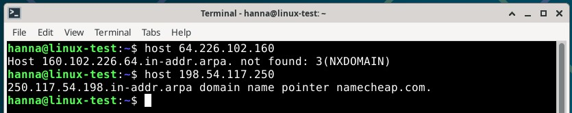

# H5 Nimekäs

Tein harjoitukset torstaina 18.9.2025, sunnuntaina 21.9.2025 ja maanantaina 22.9.2025 Helsingissä kotona. Tein torstaina harjoituksista kokonaan kohdat a) ja b) ja osittain kohdan c), sunnuntaina ja maanantaina tein loppuun kohdan c). Koneena kaikissa tehtävissä oli HP Laptop 14-cf1006no, jossa käyttöjärjestelmänä on Windows 11 Home.

Hankin ensin julkisen nimen, jonka jälkeen laitoin sen osoittamaan omaan virtuaalikoneeseeni. Tein kaksi alidomainia, toisen A-tietueella ja toisen CNAME-tietueella. Lopuksi tutkin neljän eri sivuston DNS-tietoja `host` ja `dig` -komennoilla.

## a) Nimi. Laita julkinen nimi osoittamaan omaan koneeseesi.

- Tutustuin aluksi domainnimeen, englanniksi _domain name_. Se on yksilöllinen osoite, jota käytetään mentäessä verkkosivustoille, esimerkiksi google.com. Tämä on tehty helpottamaan käyttäjien liikkumista verkossa. Nimittäin verkkosivuston varsinainen osoite on monimutkainen ja hankalasti muistettava numerosarja eli IP-osoite, esimerkiksi 192.0.2.2. Käyttäjät muodostavat yhteyden haluamalleen verkkosivustolle DNS-palvelimen avulla. Domainnimiä hallinnoivat domainrekisterit, joiden kautta voi rekisteröidä domainnimiä itselleen.
- Domainnimi koostuu kahdesta tai kolmesta osasta, jotka erotetaan toisistaan pisteellä. Oikealta vasemmalle luettaessa tunnisteet etenevät yleisimmäsä tarkimpaan. Esimerkiksi _google.co.uk_-osoitteessa:
  - _.uk_ on ylätason verkkotunnus (_TLD, top-level domain_), johon kuuluu myös esimerkiksi _.com, net_ ja maakohtaiset tunnukset, kuten _.fi_
  - _.co_ on toisen tason tunnus (_2LD, second-level domain_)
  - _google_ on kolmannen tason tunnus (_3LD, three-level domain_)
- Jos olisi google.com, tällöin siinä on vain kaksi tasoa, ensimmäinen _.com_ ja toinen _google_. (Cloudflare domain, 2025.)

- klo 14.33 Päätin ottaa domainnimen Namecheapista. Tällä tavalla saisin käytettyä GitHub Educationiin sisältyvää tarjousta ilmaisesta domain-nimestä vuodeksi. Etsin hakukoneella _Namecheap github education_, jolla pääsin _Namecheap for Education_ -sivustolle. Tässä saa käyttöönsä .me-loppuisen domainin. Karvisen mukaan parhain pääte sivustolle on .com, mutta hyvinä myös maakohtaiset tunnisteet, kuten Suomen .fi ja Ison-Britannian .co.uk. Koska tämä on testisivuni, ajattelin, että pärjään aluksi tällä .me-loppuisella. Kirjoitin kenttään haluamin domainin nimen ja klikkasin _Find_.


- 14.45 Valitsemani domainnimi, _hattara_, oli vielä vapaana ja ilmaisena .me-loppuisena nimenä, joten lisäsin sen ostoskoriin klikkaamalla domainnimen vieressä olevaa _Add_-nappia, jolloin tuote tuli oikealla olevaan ostoskoriin. Olin tyytyväinen tähän, joten klikkasin _Complete order_ -nappia.


- klo 14.56 Laitoin täpän _GitHub Pages_ -kohtaan, jotta saan ilmaisen domain-nimen ja pidin hattara.me (muita vaihtoehtoja ei ollut tässä saatavilla). Huomasin, että tekstissä lukee, että tarjoavat ilmaiset .me-domainit tietyissä yliopistoissa US:ssa, UK:ssa, Kanadassa ja Australiassa. Voihan sitä kuitenkin testata, joten kirjoitin Haaga-Helian sähköpostin. Kun olin valmis, klikkasin alhaalla olevaa _Finish Up_ -nappia.


- 15.02 Sain virheilmoituksen, jossa sanottiin _It looks like your email is not associated with an eligible university. Send us a request and we'll consider your school!_. Selvittelin asiaa.
- 15.20 Löysin GitHubin keskustelupalstalta saman asian kanssa painivan ihmisen, joka oli kirjoittanut tästä. Hänelle oltiin annettu linkki, jolla saisi GitHubin yhdistettuä NameCheapiin ja tätä kautta ilmaisen .me-domainin. Menin osoitteeseen _Get access by connecting your GitHub account on Namecheap_.


-  15.24 Annoin salasanani ja pääsin sisään. Nyt ylhäällä luki teksti _We have successfully verified your student pack with GitHub_. Testasin uudestaan ottaa hattara-domainin. Tarkistin tiedot ja koska yhä oli yhden vuoden ilmainen kokeilu, klikkasin taas _Complete order_ -nappia.


- 15.28 Kuten aikaisemminkin, laitoin täpän _GitHub Pages_ -kohtaan, kirjoitin Haaga-Helian sähköpostiosoitteen ja klikkasin _Finish Up_. Jes, tällä kertaa meni läpi! Klikkasin _Register_-nappia ja täytin vaadittavat tiedot. Kun olin valmis, klikkasin _Create_.  
- 15.39 Tarkistin vielä tilauksen tiedot ja klikkasin _Confirm Order_.


- 15.41 Lopuksi yhdistin vielä GitHubin käyttäjätilin NameCheapiin, joten klikkasin _Setup your GitHub account_. Tämä onnistui, joten nyt minulla on domaintili luotuna.


- 15.44 Menin NameCheapin etusivulle (_namecheap.com_) ja kirjauduin sisään. Sähköpostiini lähetettiin verification code, jonka annoin NameCheapin sivuilla, jonka jälkeen pääsin sisään. Tarkistin vielä, että _Domain Privacy_:n _Auto-renew_ oli poissa päältä ja se oli.


- 15.49 Nyt kun olen hankkinut domainnimen, se pitää saada osoittamaan omaan virtuaalipalvelimeen, jonka hankin viime kerralla. Klikkasin vasemmalla olevan palkin _Domain List_, josta pääsin domainnimien listanäkymään. Klikkasin hattara.me -kohdalla olevaa _Manage_-nappia, jolla sain näkyviin domainin tiedot. Menin _Advanced DNS_-kohtaan. Kohdassa _Host Records_ oli turhia A-tietueita (_A Record_) ja yksi turha _CNAME Record_, jotka poistin. Näitä oli yhteensä viisi kappaletta. Sen jälkeen klikkasin alla olevaa _Add New Record_ ja annoin alla olevat tiedot. Tallensin molemmat uudet A-tietuet klikkaamalla oikealla olevaa vihreää tick-merkkiä.
  - tyyppi (_type_) = A-tietue (_A Record_)
  - host = toiseen _www_ ja toiseen _@_
  - arvo (_value_) = virtuaalipalvelimeni IP-osoite
  - TTL (Time to Live) = 5 minuuttia


- 16.27 Nyt olen ohjannut hattara.me-sivu ohjautuu virtuaalipalvelimeni IP-osoitteeseen 64.226.102.160. Eli nyt kun kirjoitan osoitepalkkiin hattara.me tai www.hattara.me, ne ohjautuvat virtuaalipalvelilleni, jonka IP-osoite on 64.226.102.160.

- Tutustuin esille tulleisiin termeihin:
  - _A-tietue_ on yksi DNS-palvelimen tietueista, jossa A tarkoittaa osoitetta (_address_). Se kertoo tietyn domainnimen IP-osoitteen. Esimerkiksi jos haetaan cloudflare.com-sivuston DNS-tietueet, A-tietue antaa IP-osoitteen 104.17.210.9. A-tietuet sisältävät vain IPv4-osoitteita, sama toiminto IPv6-osoitteille on AAAA-tietue. Monilla verkkosivuilla on vain yksi A-tietue, mutta niitä voi olla useitakin. (Cloudflare A Record, 2025.)
  - _DNS_ on lyhenne sanoista _Domain Name System_ eli nimipalvelujärjestelmä. Sitä kutsutaan internetin puhelinluetteloksi. Koska ihmisten on vaikea muistaa tietokoneiden käyttämiä IP-osoitteita, he käyttävät domainnimiä niiden sijaan. Tarvitaan kuitenkin järjestelmä, joka muuttaa domainnimet IP-osoitteiksi ja toisin päin. Tämän tekee DNS-palvelin. (Cloudflare DNS, 2025.)
  - _TTL_ on lyhenne sanoista _Time To Live_. Se kertoo ajan, jonka välimuistissa oleva DNS-vastaus pysyy voimassa. Kun tämä aika umpeutuu, tieto pitää tarkistaa uudestaan. (Cloudflare TTL, 2025.)

## b) Alidomain. Tee kaksi uutta alidomainia, jotka osoittava omaan koneeseesi.

- Tutustuin ensin alidomainiin, joka on englanniksi _subdomain_. Niitä käytetään verkkosivuston eri osioihin, esimerkiksi kahvimukikaupalla voisi olla alidomainit blogille ja kaupalle. Niiden avulla voidaan esimerkiksi testata uutta verkkosivua ja tehdä mobiiliversion sivuille. (NameCheap, 24.8.2020.)

- klo 17.19 Tein kaksi alidomainia (_subdomain_) hattara.me-domainille. Klikkasin _Add New Record_ -nappia, jolla sain lisättyä ensin yhden uuden A-tietuen (_blog.hattara.me_) ja toisen uuden CNAME-tietuen (_shop.hattara.me_). A-tietue osoittaa suoraan IP-osoitteeseen, mutta CNAME osoittaa domainiin, joka taas osoittaa IP-osoitteeseen. Siksi tässä piti laittaa IP-osoitteen sijaan domainnimi. (NameCheap, 24.10.2024.)


- 17.40 Nyt olen tehnyt hattara.me-domainille kaksi alidomainia (blog ja shop). Kävin katsomassa jokaisen Firefox-selaimella ja ne näyttävät molemmat saman sivun kuin päädomainin sivu.


## c) Tutki jonkin nimen DNS-tietoja 'host' ja 'dig' -komennoilla. Käytä kumpaakin komentoa kaikkiin nimiin ja vertaa tuloksia.

- klo 19.10 Etsin ensin komennolla ```apt-cache search host``` kaikki tiedostot, joissa esiintyy sana host. Näitä tuli hyvin paljon, joten rajasin komentoa ```apt-cache search host | grep ^host```. Tässä tuli enää neljä vaihtoehtoa, mutta mikään ei näyttänyt oikealta. Selvittelin asiaa ja löysin oikean paketin nimen, joka on _bind9-host_ -paketti (The Debian Administrator's Handbook). Hain tämän komennolla ```apt-cache search host | grep bind9```. Tästä tuli tulokseksi oikea paketti. Latasin tämän komennolla ```sudo apt-get install bind9-host```.


- 21.9.2025 klo 18.44 Selvittelin asiaa lisää ja löysin sivun, jolla kerrotiin, että nämä molemmat komennot (dig ja host) voisi saada yhdessä ja samassa paketissa. Paketin nimi oli dnsutils ja latasin tämän komennolla ```sudo apt-get install dnsutils```. (nixCraft, 19.3.2024.) Lataus onnistui.


- 18.49 Testasin komentoa `man host`, jolla pääsin BIND9-manuaaliin. Host-komennolla tehdään DNS-kyselyjä (DNS = Domain Name System), jossa domainnimi muutetaan IP-osoitteeksi tai IP-osoite nimeksi. Listasta löytyi paljon erilaisia lisäkomentoja, joita käyttää host-komennon kanssa. Huomasin myös, että CNAME-haut pitää tehdä `-t` -komennolla. Suljin manuaalin `q`-komennolla.


- 19.04 Hain dig-manuaalin komennolla `man dig`. Täältäkin löytyi paljon erilaisia komentoja. Kuten `host`-komento, myös `dig`-komento hyvä työkalu DNS-kyselyihin.Se suorittaa DNS-kyselyjä ja näyttää nimipalvelinten antamat vastaukset. Tätä komentoa käytetään paljon DNS-ongelmien selvityksessä. Komento suoritetaan `dig @ server name type`, jossa _server_ on IP-osoite, _name_ on tietuen nimi (eli esimerkiksi .com) ja _type_ kertoo minkä tyyppinen kysely vaaditaan (jos tätä ei ole määritetty, käytetään A-tietuetta). Jos loppuun kirjoittaa komennon `NS`, saadaan tietää mitkä nimipalvelimet vastaavat kyselyyn. Sen lisäksi löysin kätevän komennon, `+short`, jolla voi näyttää vain halutun tiedon. Suljin manuaalin `q`-komennolla.


### hattara.me ja namcheap.com
- 19.48 Hain komennot `host hattara.me` ja `host namecheap.com`. Omalla domain-nimelläni haettaessa tuli viisi tulosta ja namecheapillä kaksi. Sen lisäksi tuli molempien IP-osoitteet, koska host-komento kertoo domainnimeä vastaavan IP-osoitteen. Cloudfaren sivustolla kerrotaan, että DNS-palvelimen MX-tietue (mail exchange) ohjaa sähköpostin sähköpostipalvelimelle. Domainnimien edessä olevat numerot ovat prioriteettinumeroita ja kertovat sen, mitä suositaan. Mitä alempi, sen korkeammalla se on prioriteettilistalla. Katselin prioriteettinumeroita ja niiden osoitteita ja ne osoitteet, joissa oli pienin numero osoitteessa (esimerkiksi eforward1.registrar-servers.com), niillä oli myös pienin prioriteettinumero (esimerkkiosoitteella 10). Huomasin myös, että oma sivustoni ja NameCheap käyttävät eri MX-tietueita, koska minulla on eforward ja NameCheapillä jellyfish. (Cloudflare DNS MX, 2025.)


- 20.18 Hain myös samat IP-osoitteilla ja käytin komentoja `host 64.226.102.160` ja `host 198.54.117.250`. Molemmissa näkyi `in-addr.arpa`, joka tulee, kun haetaan reverse DNS-haulla. Tämä tarkoittaa sitä, että ei haeta domainnimeä vastaava IP-osoite, vaan IP-osoitetta vastaava domainnimi. in-addr.arpa vastaa käänteisten kyselyiden suorittamisesta. (Windows Server Learn, 24.3.2025.) Huomasin, että oman sivustoni haku ei onnistunut, mutta NameCheapin onnistui.



- 22.9.2025 klo 15.15 Hain molemmista dig-tiedot komennoilla `dig hattara.me`. 
  - _Opcode: QUERY_: mitä pyydetiin eli tässä tapauksessa kyselyä. Jos testataan DNS:n tilaa, lukisi _status_
  - _Status: Noerror_: ei ollut virheitä eli pyyntö käsiteltiin oikein
  - _Authority: 0_: vastaukset, jotka tulevat _Authoritative Name Server_:ltä (tässä tapauksessa 0 kpl), vastaus palautettiin DNS:n välimuistista (_cache_)
  - _QUESTION SECTION_ ja _ANSWER SECTION_:
    - _hattara.me_: domain, jonka tietoja haettiin
    - _IN_: internet class -kyselyn tekeminen
    - _A_: dig käyttää A-tietuetta (_A record_) DNS-serveriltä, ellei muuta ilmoiteta
    - _300_: Time to Live (TTL) eli aikaväli, jonka tietue saa olla tallennettuna välimuistiin. Kun se on vanhentunut, tieto on haettava uudestaan DNS-palvelimelta. Ilmoitetaan sekunteina
  - _Query time: 840 msec_: kuinka kauan kesti saada vastaus, tässä 840 millisekuntia
  - _SERVER: 192.168.1.1#53(192.168.1.1.) (UDP)_: vastanneen DNS-palvelimen IP-osoite ja porttinumero
  - _WHEN_: milloin pyyntö on tehty
  - _MSG SIZE rcvd: 55_: DNS-serveriltä saadun viestin koko
(How-to-Geek, 5.2.2024.)


- 15.49 Hain vielä komennolla `dig hattara.me NS` nimipalvelun. Tässä tapauksessa niitä on kaksi ja ne ovat _dns1.registrar-servers.com_ ja _dns2.registrar-servers.com_. Nyt A-tietuen tilalla on NS eli nameserver, joka on DNS-serverin tyyppi.


- 15.51 Hain myös NameCheapille dig-tiedot komennolla `dig namecheap.com` ja `dig namecheap.com NS`. NameCheapillä on paljon enemmän nimipalveluja kuin hattara.me:llä. Myös TTL-arvo on korkeampi, kun hattaralla se oli 1800 ja tässä 3600 sekuntia. TTL nopeuttaa verkon toimintaa, koska sivua ei aina tarvitse hakea uudestaan, mutta toisaalta jos arvo on kovin suuri, käyttäjälle voi näkyä vanha tieto.


### Pikkyritys, kerho tai yksittäisen henkilön sivut

- 16.00 Valitsin Kaisa Jaakkolan -verkkosivut, jotka ovat yksittäisen henkilön. Tein komennon `host kaisajaakkola.com`, josta näin IP-osoitteen (_31.217.192.93_) ja sähköpostia hallitsevan palvelimen nimen (_mailwp06.hostingpalvelu.fi_). Käytin saatua IP-osoitetta hyväksi ja ajoin komennon `host 31.217.192.93`.

- ... KUVA 21 ...

- 16.10 Hain Kaisa Jaakkolan dig-tiedot komenoilla `dig kaisajaakkola.com` ja `dig kaisajaakkola.com NS`. Tiedot näyttävät aika samoilta, mutta tietoa ei haeta A-tietueesta vaan NS-tietueesta. TTL on myös aika iso, vasemalla olevassa kuvassa 13862 ja oikealla 28800 sekuntia. Toisaalta käyttäjälle ei ole haittaa, jos hän näkee hieman pidemmän aikaa vanhat tiedot, varsinkin kun sivua ei päivitetä niin usein.

- ... KUVA 22 a + b ...

### Suuri, kaikkien tuntema palvelu

- 18.42 Valitsin Instagramin suureksi palveluksi. Ajoin komennon `host instagram.com`. Instagramilla on sekä IPv4-osoite että IPv6-osoite. Sähköpostipalvelimia oli kaksi, toinen _mxa_ ja toinen _mxb_. sen lisäksi listassa oli _HTTP service bindings_, joka on uudenlainen tietuetyyppi, joka esimerkiksi kertoo käytetäänkö HTTP/2 vai HTTP/3:sta ensisijaisesti (Cloudflare, 30.9.2020). Tein myös haun IP-osoitteella, `host 157.240.205.174`. Domain pointer osoittaa Instagramin johonkin omaan osoitteeseen.

- ... KUVA 23 ...

- 18.57 Sen jälkeen annoin komennot `dig instagram.com` ja `dig instagram.com NS`. Toisella komennolla (oikealla) tuli enemmän tietoa kuin ensimmäisellä (vasemmalla). TTL-aika oli hyvin lyhyt, vain 35 sekuntia. Tämän takia palvelin joutuu kovemmalle rasitukselle, mutta toisaalta käyttäjät saavat uudet tiedot nopeasti. Uskoisin tämän lyhyen TTL-ajan olevan sen takia, koska Instagram on tehty palveluksi, jossa on koko ajan uutta ja sitä tulee nopealla tahdilla katsottavaksi. Instagramilla on käytössä enemmän nimipalveluja ja jokaisen niiden TTL-arvo on matala, 1952. Sen lisäksi nähdään _Additional Section_:ssa nimipalveluiden A- ja AAAA-tietuet eli IPv4- ja IPv6-osoitteet.

- ... KUVA 24 a ja b ...


## Lähteet

- Cloudflare, 30.9.2020. Speeding up HTTPS and HTTP/3 negotiation with... DNS. Luettavissa: https://blog.cloudflare.com/speeding-up-https-and-http-3-negotiation-with-dns/. Luettu: 22.9.2025.
- Cloudflare, 2025. DNS A record. Luettavissa: https://www.cloudflare.com/learning/dns/dns-records/dns-a-record/. Luettu: 18.9.2025.
- Cloudflare, 2025. What is a DNS MX record? Luettavissa: https://www.cloudflare.com/learning/dns/dns-records/dns-mx-record/. Luettu: 21.9.2025.
- Cloudflare, 2025. What is a domain name? | Domain name vs. URL. Luettavissa: https://www.cloudflare.com/learning/dns/glossary/what-is-a-domain-name/. Luettu: 18.9.2025.
- Cloudflare, 2025. What is DNS? | How DNS works. Luettavissa: https://www.cloudflare.com/learning/dns/what-is-dns/. Luettu: 18.9.2025.
- Cloudflare, 2025. What is time-to-live (TTL)? | TTL definition. Luettavissa: https://www.cloudflare.com/learning/cdn/glossary/time-to-live-ttl/. Luettu: 18.9.2025.
- How-to-Geek, 5.2.2024. How to Use the dig Command on Linux. Luettavissa: https://www.howtogeek.com/663056/how-to-use-the-dig-command-on-linux/. Luettu: 22.9.2025.
- NameCheap, 24.8.2020. What is a Subdomain? Definition & Examples. NameCheap Blog. Luettavissa: https://www.namecheap.com/blog/what-is-a-subdomain-dp/. Luettu: 18.9.2025.
- NameCheap, 24.10.2024. How to Create a Subdomain for my Domain. https://www.namecheap.com/support/knowledgebase/article.aspx/9776/2237/how-to-create-a-subdomain-for-my-domain/
- nixCraft, 19.3.2024. How to install dig on Debian Linux 12/11/10. Luettavissa: https://www.cyberciti.biz/faq/debian-9-dig-command-not-found-how-to-install-dig-on-debian/. Luettu: 21.9.2025.
- The Debian Administrator's Handbook. Luettavissa: https://www.debian.org/doc/manuals/debian-handbook/sect.domain-name-servers.en.html#sect.dns-config. Luettu: 18.9.2025.
- Windows Server Learn, 24.3.2025. Reverse lookup. Luettavissa: https://learn.microsoft.com/en-us/windows-server/networking/dns/reverse-lookup. Luettu: 21.9.2025.
- Pohjana Tero Karvinen 2025: Linux palvelimet 2025 alkusyksy. Luettavissa: https://terokarvinen.com/linux-palvelimet. Luettu: 22.9.2025.
