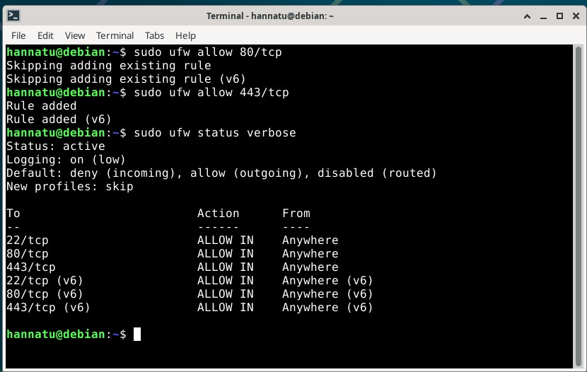
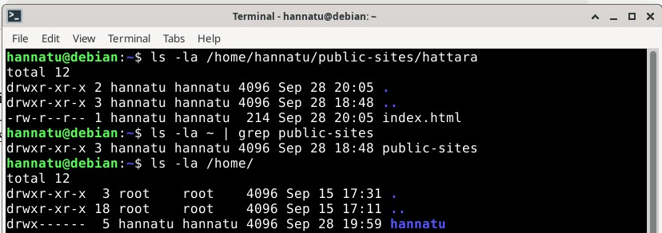
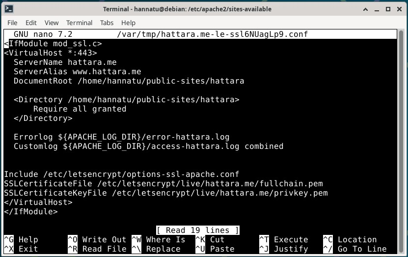
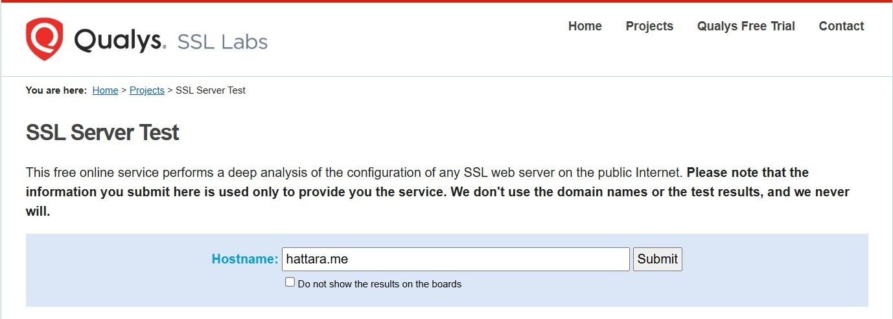
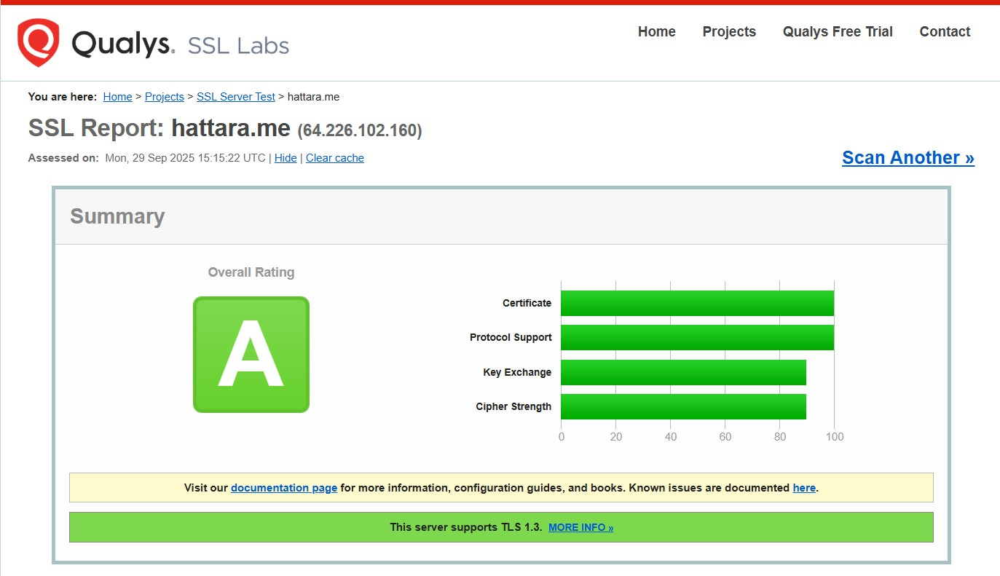

# H6 Salataampa

## x) Tiivistelmät

### Let's Encrypt 2024: How It Works

- Let’s Encrypt ja ACME-protokollan avulla hankitaan ja uusitaan automaattisesti salattu HTTPS-palvelin eikä ihmisen ei tarvitse tehdä tätä käsin.
- Prosessissa ACME todistaa sertifikaatin myöntäjälle (CA eli Certificate Authority), että web-palvelin hallitsee domainia. Kun tämä on hoidettu, asiakas voi pyytää tai peruuttaa sertifikaatteja kyseiselle domainille. 

#### Domainin validointi

- Let’s Encrypt tunnistaa ACME-asiakasohjelmiston julkisen avaimen avulla. Ensimmäisellä kerralla, kun ACME on vuorovaikutuksessa Let's Encryptin kanssa, se luo uuden avainparin. Tällä ACME todistaa Let's Encryptin CA:lle, että operaattori hallitsee yhtä tai useampaa domainia. 
- Miten tämä tapahtuu?
  - Asiakas kysyy Let’s Encryptin CA:lta mitä sen täytyy tehdä, kun se haluaa todistaa hallitsevansa tiettyä domainia.
  - Let’s Encryptin CA tarkistaa domainin ja lähettää yhden tai useamman haasteen (_challenge_).
  - Asiakasohjelmisto suorittaa yhden näistä annetuista haasteista.
  - Kun asiakas on valmis, se ilmoittaa siitä CA:lle.
  - CA tarkistaa onko haasteet ratkaistu useista verkon näkökulmista. Jos haasteet onnistuvat, asiakas on valtuutettu ja voi tällöin tehdä sertifikaattien hallintaa tietyllä domainilla. 

#### Sertifikaatin myöntäminen ja peruuttaminen

- Sen jälkeen kun asiakas on valtuutettu, sertifikaatin pyytäminen, uusiminen ja peruuttaminen on yksinkertaista. Se tehdään lähettämällä sertifikaattien hallintaviestejä ja allekirjoittamalla ne valtuutetun avainparilla.
- Myöntäminen: asiakas tekee pyynnön Let's Encryptin CA:lle, jossa se pyytää sertifikaattia tietylle domainille käyttäen julkista avainta. Kun Let’s Encrypt CA saa pyynnön, se verifioi allekirjoitukset. Jos kaikki on hyvin, se myöntää sertifikaatin domainille. CA lähettää varmenteen moniin julkisiin Certificate Transparency -lokeihin.
- Peruuttaminen: Toimii samoin kuin myöntäminen. Asiakas kirjoittaa peruutuspyynnön, jossa käytetään tietyn domainin avainparia. Let's Encrypt CA tarkistaa, että pyyntö on valtuutettu. Jos se on, se julkaisee peruutustiedon Certificate Revocation List:ssä. Tällöin esimerkiksi selaimet tietävät olla hyväksymättä peruutettua sertifikaattia.

(Let's Encrypt 2.8.2025)

### The Apache Software Foundation 2025: Apache HTTP Server Version 2.4

- Yksinkertainen esimerkki konfiguraatiosta: 
```
LoadModule ssl_module modules/mod_ssl.so

Listen 443
<VirtualHost *:443>
    ServerName www.example.com
    SSLEngine on
    SSLCertificateFile "/path/to/www.example.com.cert"
    SSLCertificateKeyFile "/path/to/www.example.com.key"
</VirtualHost>
```
- SSL-konfiguraation pitää sisältää vähintään nämä tiedot.

(The Apache Software Foundation 2025)

## Virtuaalikonetehtävät

Tein harjoitukset sunnuntaina 28.9.2025 ja maanantaina 29.9.2025 Helsingissä kotona. Koneena kaikissa tehtävissä oli HP Laptop 14-cf1006no, jossa käyttöjärjestelmänä on Windows 11 Home.

Tein ensin sivustolleni Name Based Virtual Hostin ja tämän jälkeen hankin domainille TLS-sertifikaatin Let's Encryptiltä. Tämän jälkeen testasin sivun SSLLabs-laadunvarmistustyökalulla. 

## a) Let's. Hanki ja asenna palvelimellesi ilmainen TLS-sertifikaatti Let's Encryptilta. Osoita, että se toimii.

- 17.45 Avasin VirtualBoxin ja kirjauduin terminaalissa virtuaalipalvelimelleni komennolla `ssh hannatu@hattara.me`. Annoin salasanani ja pääsin sisään.
- 17.50 Varmistin, että sivuni toimii vielä. Avasin Firefoxin selaimen ja menin osoitteeseen hattara.me. Päivitin varmuuden vuoksi sivun _ctrl+shift+r_. Sivu näkyi yhä, joten kaikki vielä kunnossa.
- 17.52 Tein varmuuden vuoksi virtuaalikoneelle päivitykset komennolla `sudo apt-get update`. Annoin salasanani ja teki päivitykset.
- 18.00 Potkaisin vielä varmuuden vuoksi Apache2-demonia komennolla `sudo systemctl reload apache2`. Tämän jälkeen tarkistin vielä, että verkkosivu hattara.me toimii Firefoxilla (päivitin sivun ctrl+shift+r) ja kännykän Safari-selaimella. Molemmissa toimii hyvin.


  
- 18.05 Kun alkuvalmistelut on tehty, siirrytään salaamiseen. Avasin tulimuurista portit 80 ja 443 eli HTTP:n ja HTTPS:n portit. Annoin komennot `sudo ufw allow 80/tcp` ja `sudo ufw allow 443/tcp`. HTTP:n portti 80 olikin jo auki. Tarkistin vielä, että portit ovat auki komennolla `sudo ufw status verbose`. Portit 80 ja 443 ovat auki sekä IPv4:lle että IPv6:lle.



- 18.12 Asensin certbotin komennolla `sudo apt-get install certbot python3-certbot-apache`, joka latasi ohjelman. Certbot on Let's encryptin työkalu, jonka avulla saadaan HTTPS käyttöön.  


- 18.20 Hain domainnimilleni varmenteen. Tämä tapahtui komennolla `sudo certbot --apache --domains hattara.me,www.hattara.me`. Jouduin laittamaan sähköpostiosoitteeni, koska ei päästänyt eteenpäin ilman sitä. Sen lisäksi ei löytänyt www.hattara.me. Tajusin tämän johtuvan siitä, että tuolla sivulla ei ole vielä tehty AliasNamea Name Based Virtual Hostina.
- 18.34 Asensin micro-editorin komennolla `sudo apt-get install micro`. Tein konfiguraatiotiedoston komennolla `sudoedit /etc/apache2/sites-available/hattara.me.conf`. 


- 18.48 Tein kansion `mkdir -p /home/hannatu/public-sites/hattara`.
- 19.13 Otin verkkosivustolle Apache2:n käyttöön komennolla `sudo a2ensite hattara.me`. Tämän jälkeen käynnistin Apache2 uudestaan komennolla `sudo systemctl restart apache2`. Tein komennon `curl localhost`, joka toimi vielä, mutta Firefoxilla tuli _Forbidden_. Joku oli siis vielä pielessä.


- 19.49 Testasin korvata testisivun komennolla `echo "It's me, hi!" | sudo tee /var/www/html/index.html`. Yhä toimii `curl localhost`-komennolla, mutta ei Firefoxissa.
- 19.55 Tajusin, etten ollut tehnyt vielä _index.html_-sivua. Menin hattara-kansioon komennolla `cd /home/hannatu/public-sites/hattara/` ja loin sinne index.html-tiedoston komennolla `micro index.html`. Kopioin koodin Karvisen sivuilta (Karvinen 12.2.2012). Tallensin tekemäni muutokset _ctrl+s_ ja suljin micro-editorin _ctrl+q_.


- 20.07 Potkaisin taas Apache2:n käyntiin komennolla `sudo systemctl restart apache2`. Firefox antaa sivustolle yhä _Forbidden_.
- 20.19 Tarkastin kansioiden oikeudet komennolla `ls -la /home/hannatu/public-sites/hattara`, `ls -la ~ grep public-sites` ja `ls -la /home/`. Viimeisen komennon alimmalla rivillä (hannatu) ei ollut suoritusoikeutta (execute) muille.



- 20.21 Lisäsin oikeudet komennolla `chmod o+x /home/hannatu` ja tarkistin, että meni läpi. Oikeus oli tullut, joten tarkistin vielä viimeiset oikeudet komennolla `ls -la / | grep home`. Päivitin vielä Apachen komennolla `sudo systemctl reload apache2`. 


- 20.27 Firefox näytti sivulla tekstin, jonka sen pitäisikin näyttää, mutta `curl localhost`-komento ei. Ajoin komennon `curl -H 'Host: hattara.me' localhost`, jolla sain näkyviin saman tekstin, joka Firefoxissa näkyy.


- 20.33 Tämä ei kuitenkaan auttanut, koska komento `curl localhost` antaa yhä vanhan tekstin. Otin Apachen default-sivun pois käytöstä komennolla `sudo a2dissite 000-default` ja sen jälkeen päivitin sen `sudo systemctl reload apache2`. Testasin `curl localhost`-komentoa ja nyt toimii. Jee! Nyt näyttää molemmissa paikoissa (curl localhost ja Firefox) sen minkä pitääkin.


- 20.36 Jätän tehtävien tekemisen tähän ja jatkan huomenna. Suljin yhteyden virtuaalipalvelimeen komennolla `exit`, jonka jälkeen suljin terminaalin ja virtuaalikoneen.
- 29.9. klo 15.18 Yritin uudestaan hankkia sertifikaatit. Minulla oli jo avattuna portit 80 ja 443 sekä certbot asennettuna. Tarkistin vielä, että web-sivuni toimii virtuaalikoneen Firefoxilla ja kännykän Safari-selaimella. Molemmilla toimi.
- 15.22 Kirjauduin terminaalissa virtuaalipalvelimelleni komennolla `ssh hannatu@hattara.me`. Annoin salasanani ja pääsin sisään.
- 15.23 Yritin uudestaan hakea domainnimilleni sertifikaatin. Tein tämän komennolla `sudo certbot --apache --domains hattara.me,www.hattara.me`. Koska olin yrittänyt tätä jo aikaisemmin, kysyttiin haluanko uudelleenasentaa tämän olemassaolevan sertifikaatin vai yrittää saada uuden. Vastasin, että haluan uudelleenasentaa vanhan. Nyt sain onnistuneesti sertifikaatit molemmille domainnimille, kun aikaisemmin onnistui vain toinen (ilman www-alkua).


- 15.32 HTTP-sivu ei kuitenkaan ohjaudu vielä HTTPS-sivulle automaattisesti, joten ehkä tämä täytyi vielä muuttaa. Menin komennolla `cd /etc/apache2/sites-available/` sivustojen konfiguraatiotiedostoihin ja katsoin komennolla `ls` mitä tiedostoja ja kansioita siellä on.


- 15.39 Kansiosta löytyi _hattara.me.conf_, jonka avasin muokattavaksi komennolla `sudoedit hattara.me.conf`. Tämä näytti kuitenkin hyvältä. Suljin editorin _ctrl+x_.


- 15.47 Avasin toisen konfiguraation komennolla `sudoedit hattara.me-le-ssl.conf`. Tämä näytti kanssa hyvältä, joten suljin editorin _ctrl+x_



- 16.08 Testasin mennä Firefoxilla hattara.me-osoitteeseen ja se vei minut suoraan HTTPS-sivustolle. Testasin myös mennä http://hattara.me ja tämä myös vei suoraan HTTPS-sivustolle. Myös molemmat hattara.me ja www.hattara.me veivät suojatulle HTTPS-sivulle. Testasin myös kännykän Safarilla ja toimi sielläkin.


- 16.11 URL-osoitteen vieressä oleva lukko ei ollut enää yliviivattuna, koska nyt käytössä on suojattu yhteys aikaisemman suojaamattoman yhteyden sijaan.


- 16.14 Testasin tunnilla ollutta config-testiä komennolla `sudo apache2ctl configtest`. Alussa valitti, mutta tärkeimpänä oli se, että lopussa luki _Syntax OK_. Latasin Apache2:n asetukset vielä varmuuden vuoksi uudelleen komennolla `sudo systemctl restart apache2`.


- 16.20 Suljin SSH-yhteyden komennolla `exit` ja suljin virtuaalikoneen.

## b) A-rating. Testaa oma sivusi TLS jollain yleisellä laadunvarmistustyökalulla, esim. SSLLabs (Käytä vain tavanomaisia tarkistustyökaluja, ei tunkeutumistestausta eikä siihen liittyviä työkaluja)

- 18.13 Menin [SSLLabs](https://www.ssllabs.com/ssltest/)-sivustolle, jossa pääsin testaamaan oman sivustoni salausta. Kirjoitin _Hostname_-hakukentään hattara.me ja klikkasin _Submit_. 



- 18.15 Kesti hetken, kun sivusto teki testinsä. Kokonaisarvioksi tuli A. Sertifikaatti ja protokollatuki olivat molemmat 100%, kun avaimenvaihto ja salauksen vahvuus olivat 90%. 




## Lähteet

- Let's Encrypt 2.8.2025. How It Works. Luettavissa: https://letsencrypt.org/how-it-works/. Luettu: 28.9.2025.
- The Apache Software Foundation 2025: Apache HTTP Server Version 2.4 [Official] Documentation: SSL/TLS Strong Encryption: How-To: Basic Configuration Example. Luettavissa: https://httpd.apache.org/docs/2.4/ssl/ssl_howto.html#configexample. Luettu: 28.9.2025.
- Karvinen, T 12.2.2012. Short HTML5 page. Luettavissa: https://terokarvinen.com/2017/starting-with-javascript-arrays-for-of-f12-console/2012/short-html5-page. Luettu: 28.9.2025.
