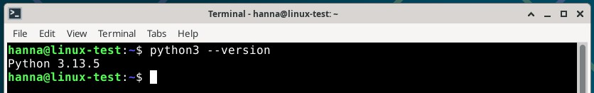
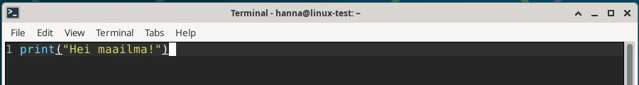
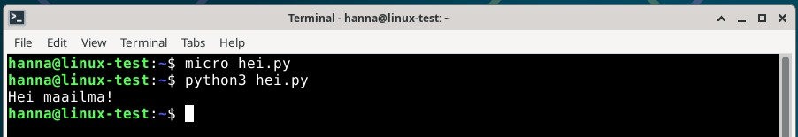
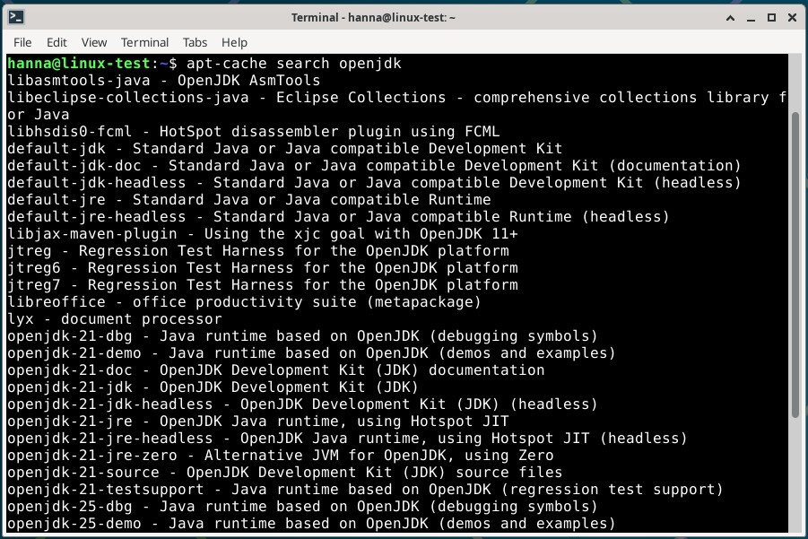
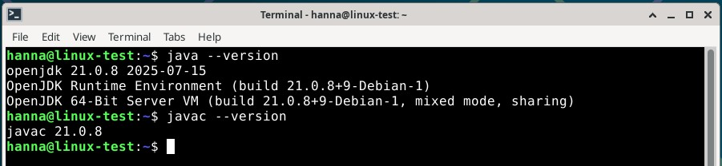
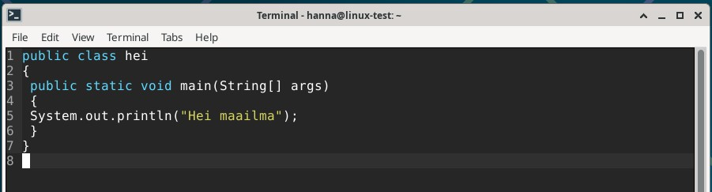
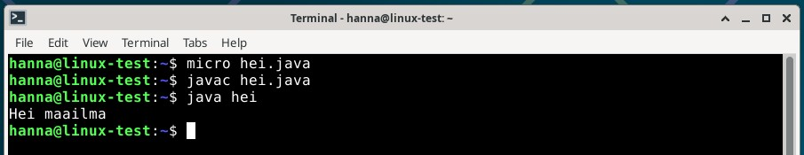
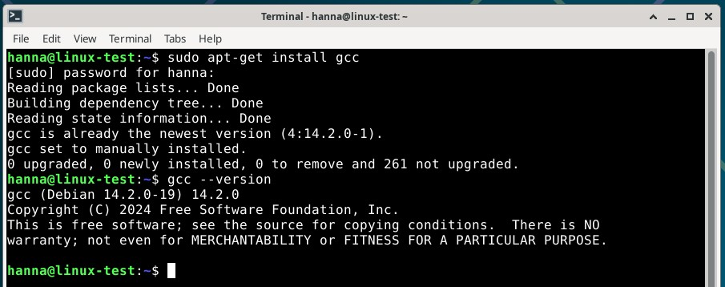
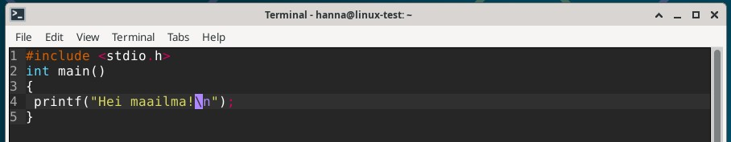
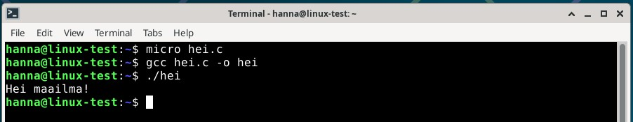

# H7 Maalisuora

## Yleistä tehtävistä

Tein harjoitukset torstaina 02.10.2025 ... ... Helsingissä kotona. Tein torstaina harjoituksista kohdan a) ... ... . Koneena kaikissa tehtävissä oli HP Laptop 14-cf1006no, jossa käyttöjärjestelmänä on Windows 11 Home.

## a) Kirjoita ja aja "Hei maailma" kolmella kielellä.

- Ensin tutustuin Karvisen sivuilla erilaisiin kieliin, joilla voi kirjoittaa koodia Linuxissa (Karvinen, 27.9.2018). Valitsin tehtävään Python 3:n, Javan ja C:n. Ajattelin, että näitä voisin eniten tarvita, joten päätin harjoitella niiden kanssa.
- klo 18.25 Avasin VirtualBoxin, oman virtuaalikoneeni ja terminaalin. Koska tiesin, että tulen asentamaaan uusia ohjelmia, päivitin paketit komennolla `sudo apt-get update`.

### Python 3

- 18.28 Python 3:n pitäisi olla automaattisesti asennettuna Debian 13:sta, joten tarkistin sen versionumeron. Tein tämän komennolla `python3 --version`, joka näytti olevan `Python 3.13.5`. Tämä myös kertoi sen, että Python 3 on jo asennettuna virtuaalikoneelle.

  
- 18.31 Annoin komennon `micro hei.py`, joka avasi microeditorin. Kirjoitin editoriin `print("Hei maailma!")`, tallensin sen _ctrl+s_ ja suljin sen _ctrl+q_. 

- 18.39 Ajoin komennon `python3 hei.py`, joka antoi vastaukseksi `Hei maailma!`.
 

### Java

- 18.41 Seuraavaksi testasin Javaa. Koska minulla ei ollut sitä asennettuna virtuaalikoneelle, asensin sen komennolla `sudo apt-get install openjdk-17-jdk`. Huomasin, ettei paketti asentunut, vaan ilmoitti virheestä, ettei pakettia löydy. Hain komennolla `apt-cache search openjdk`. Katsoin listaa ja löysin _openjdk-21-dbg_, jonka asensin komennolla `sudo apt-get install openjdk-21-jdk`. Asentamisessa kesti hetken. 

- 19.20 Tarkistin, että java oli asentunut tarkistamalla versionumerot javasta ja javac:stä. Tein nämä komennoilla `java --version` ja `javac --version`.

- 19.22 Avasin microeditorin komennolla `micro hei.java`. Kirjoitin editoriin koodinpätkän, jossa käytin pohjana Karvisen sivuilla olevaa koodia (Karvinen, 27.9.2018). Tallensin _ctrl+s_ ja suljin editorin _ctrl+q_. 

- 18.53 Ajoin komennon `javac hei.java`. Javac on kääntäjä, joka ottaa lähdekooditiedoston (_hei.java_) ja kääntää sen .class-tiedostoksi, jonka jälkeen se voidaan ajaa (Oracle 2025). Nyt kun java-koodi on muutettu ajettavaan muotoon, voin ajaa sen. Ajoin sen komennolla `java hei` ja tämä antoi tulokseksi juuri sen minkä pitikin. 

### C

- 19.32 Viimeisenä valitsemanani kielenä oli C. Asensin C-kielipaketin komennolla `sudo apt-get install gcc`. Asennuksen jälkeen tarkistin C-paketin versionumeron komennolla `gcc --version`. 

- 19.37 Avasin microeditorin komennolla `micro hei.c`. Kirjoitin editoriin C-koodia, jossa käytin pohjana Karvisen sivuilla olevaa koodia (Karvinen, 27.9.2018). Tallensin _ctrl+s_ ja suljin editorin _ctrl+q_. 

- 19.41 C-kielessä tarvitaan myös kääntäjää, jonka tein komennolla `gcc hei.c -o hei` ja tämän jälkeen ajoin tiedoston komennolla `./hei`. Sain tulosteena `Hei maailma!`, joten toimii kuten pitääkin.

## Lähteet

- Karvinen, T. 27.9.2018. Hello World Python3, Bash, C, C++, Go, Lua, Ruby, Java – Programming Languages on Ubuntu 18.04. Luettavissa: https://terokarvinen.com/2018/hello-python3-bash-c-c-go-lua-ruby-java-programming-languages-on-ubuntu-18-04/. Luettu: 2.10.2025.
- Oracle 2025. The javac Command. Luettavissa: https://docs.oracle.com/en/java/javase/17/docs/specs/man/javac.html. Luettu: 2.10.2025.
- Pohjana Johanna Heinonen 2025: Linux Shell Scripting Basics. Luettavissa: https://github.com/johannaheinonen/johanna-test-repo/blob/main/linux-01102025.md. Luettu: 2.10.2025.
- Pohjana Tero Karvinen 2025: Linux palvelimet 2025 alkusyksy. Luettavissa: https://terokarvinen.com/linux-palvelimet. Luettu: 2.10.2025.
