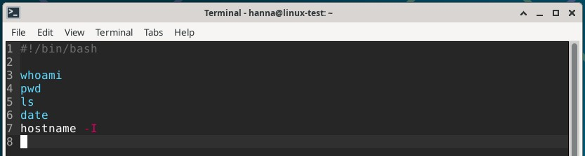

# H7 Maalisuora

## Yleistä tehtävistä

Tein torstaina 02.10.2025 harjoituksista kohdat a) ja b), perjantaina 03.10.2025 c)-kohdan ja aloitin d)-kohtaa ja sunnuntaina 5.10.2025 tein loppuun d)-kohdan. Tehtävien b)-kohdassa tarkistin raporttien viittaukset, joten sitä ei ole esitetty tässä raportissa. Tein kaikki tehtävät Helsingissä kotona. Koneena kaikissa tehtävissä oli HP Laptop 14-cf1006no, jossa käyttöjärjestelmänä on Windows 11 Home.

## a) Kirjoita ja aja "Hei maailma" kolmella kielellä

- Ensin tutustuin Karvisen sivuilla erilaisiin kieliin, joilla voi kirjoittaa koodia Linuxissa (Karvinen, 27.9.2018). Valitsin tehtävään Python 3:n, Javan ja C:n. Ajattelin, että näitä voisin eniten tarvita, joten päätin harjoitella niiden kanssa.
- klo 18.25 Avasin virtuaalikoneen ja koska tiesin, että tulen asentamaaan uusia ohjelmia, päivitin paketit komennolla `sudo apt-get update`.

### Python 3

- 18.28 Python 3:n pitäisi olla automaattisesti asennettuna Debian 13:sta, joten tarkistin sen versionumeron. Tein tämän komennolla `python3 --version`, joka näytti olevan `Python 3.13.5`. Tämä myös kertoi sen, että Python 3 on jo asennettuna virtuaalikoneelle.

  
- 18.31 Annoin komennon `micro hei.py`, joka avasi microeditorin. Kirjoitin editoriin `print("Hei maailma!")`, tallensin sen _ctrl+s_ ja suljin sen _ctrl+q_. 

- 18.39 Ajoin komennon `python3 hei.py`, joka antoi vastaukseksi `Hei maailma!`.
 

### Java

- 18.41 Seuraavaksi testasin Javaa. Koska minulla ei ollut sitä asennettuna virtuaalikoneelle, asensin sen komennolla `sudo apt-get install openjdk-17-jdk`. Huomasin, ettei paketti asentunut, vaan ilmoitti virheestä, ettei pakettia löydy. Hain komennolla `apt-cache search openjdk`. Katsoin listaa ja löysin _openjdk-21-dbg_, jonka asensin komennolla `sudo apt-get install openjdk-21-jdk`. Asentamisessa kesti hetken. 

- 19.20 Tarkistin, että java oli asentunut tarkistamalla versionumerot javasta ja javac:stä. Tein nämä komennoilla `java --version` ja `javac --version`.

- 19.22 Avasin microeditorin komennolla `micro hei.java`. Kirjoitin editoriin koodinpätkän, jossa käytin pohjana Karvisen sivuilla olevaa koodia (Karvinen, 27.9.2018). Tallensin _ctrl+s_ ja suljin editorin _ctrl+q_. 

- 18.53 Ajoin komennon `javac hei.java`. Javac on kääntäjä, joka ottaa lähdekooditiedoston (_hei.java_) ja kääntää sen .class-tiedostoksi, jonka jälkeen se voidaan ajaa (Oracle 2025). Nyt kun java-koodi on muutettu ajettavaan muotoon, voin ajaa sen. Ajoin sen komennolla `java hei` ja tämä antoi tulokseksi juuri sen minkä pitikin. 

### C

- 19.32 Viimeisenä valitsemanani kielenä oli C. Asensin C-kielipaketin komennolla `sudo apt-get install gcc`. Asennuksen jälkeen tarkistin C-paketin versionumeron komennolla `gcc --version`. 

- 19.37 Avasin microeditorin komennolla `micro hei.c`. Kirjoitin editoriin C-koodia, jossa käytin pohjana Karvisen sivuilla olevaa koodia (Karvinen, 27.9.2018). Tallensin _ctrl+s_ ja suljin editorin _ctrl+q_. 

- 19.41 C-kielessä tarvitaan myös kääntäjää, jonka tein komennolla `gcc hei.c -o hei` ja tämän jälkeen ajoin tiedoston komennolla `./hei`. Sain tulosteena `Hei maailma!`, joten toimii kuten pitääkin.

## c) Laita Linuxiin uusi, itse tekemäsi komento niin, että kaikki käyttäjät voivat ajaa sitä

- 3.10. klo 18.35 Tutustuin Karvisen sivuilla olevaan ohjeeseen aiheesta (Karvinen, 4.12.2007). Päätin tehdä ohjelman, josta saa selville kuka on kyseessä (_whoami_), sijainnin (_pwd_) ja ajan (_date_).
- 18.41 Avasin virtuaalikoneen. Annoin komennon `micro kaikille.sh`, joka avasi micro-editorin. Kirjoitin alkuun `#!/bin/bash` ja perään `whoami`, `pwd` ja `date`. Tallensin tämän _ctrl+s_ ja suljin editorin _ctrl+q_.

 
- 18.47 Katsoin oikeudet juuri tehdylle tiedostolle `kaikille.sh` komennolla `ls -l kaikille.sh`. Kenelläkään ei ollut execute-oikeuksia, joten lisäsin ne komennolla `chmod a+x kaikille.sh`. Tarkistin vielä, että olihan execute-oikeudet tulleet kaikille ajamalla komennon `ls -l kaikille.sh` uudestaan. Olivat tulleet.

- 18.55 Ajoin komennon `./kaikille.sh` ja se toimi kuten pitikin. Tämän jälkeen kopioin tiedoston, jotta kaikki käyttäjät voivat ajaa sen. Tein tämän komennolla `sudo cp kaikille.sh /usr/local/bin/`. Nyt tämän pitäisi toimia kaikille. Testasin vielä ajaa tiedoston komennolla `kaikille.sh`. Tämä tuotti saman tuloksen kuin aikaisemmin ja ilman alussa olevaa `./` (_piste ja kauttaviiva_). Tämä johtuu siitä, että aikaisemmin kerrottiin shellille, että sen pitää ajaa ohjelma tästä tietystä hakemistosta, mutta kun tiedosto kopioitiin PATH-hakemistoon, shell löytää sen sieltä automaattisesti.

## d) Ratkaise vanha arvioitava laboratorioharjoitus soveltuvin osin

- 3.10. klo 19.15 Hain Karvisen sivuilta laboratorioharjoituksia hakusanalla _laboratorio_. Valitsin _Final Lab for Linux Palvelimet 2024 Spring_ -harjoitukset. Jätin laboratorioharjoituksen alussa olevat kohdat a)-c) (Taustatiedot, Tiivistelmä koko työstä lopuksi, Ei kolmea sekoseiskaa) tekemättä, koska koska koskevat toisenlaisen raportin tekemistä. Sen lisäksi jätin tekemättä lopusta kohdat h) ja h) (Djangon lahjat ja Tuotantopropelli), koska kohdissa d), e) ja g) kesti ihan riittävästi.

### d) 'howdy'
Tehtävä:
- Tee kaikkien käyttäjien käyttöön komento 'howdy'.
  - Tulosta haluamaasi ajankohtaista tietoa, esim päivämäärä, koneen osoite tms.
  - Pelkkä "hei maailma" ei riitä.
- Komennon tulee toimia kaikilla käyttäjillä työhakemistosta riippumatta

Ratkaisu:
- Tässä tehtävässä käytetty apuna Karvisen ja Heinosen ohjeita Shell Scriptistä (Karvinen, 4.12.2007, Heinonen 2025).
- 19.20 Tein howdy.sh-tiedoston komennolla `micro howdy.sh`. Kirjoitin sinne alkuun `#!/bin/bash` ja perään `whoami`, `pwd`, `ls`, `date` ja `hostname -I`. Tallensin tiedoston _ctrl+s_ ja suljin editorin _ctrl+q_.

- 19.29 Annoin kaikille oikeudet komennolla `chmod a+x howdy.sh`. Ajoin komennon `./howdy.sh`. Tulostui juuri ne tiedot, jotka pitikin. Jotta komento toimii kaikilla käyttäjillä, kopioin sen vielä _/usr/local/bin/_-kansioon komennolla `sudo cp howdy.sh /usr/local/bin/`. Lopuksi testasin vielä ajaa tämän komennolla `howdy.sh`, joka toimi.

### e) Etusivu uusiksi
Tehtävä:
- Asenna Apache-weppipalvelin
- Tee yrityksellemme "AI Kakone" kotisivu
- Kotisivu tulee näkyä koneesi IP-osoitteella suoraan etusivulla
- Sivua pitää päästä muokkaamaan normaalin käyttäjän oikeuksin (ilman sudoa). Liitä raporttiisi listaus tarvittavien tiedostojen ja kansioiden oikeuksista.

Ratkaisu:
- Tässä tehtävässä käytetty apuna Karvisen ohjeita Name Based Virtual Hostista (Karvinen, 10.4.2018) ja HTML-sivusta (Karvinen, 12.2.2012) sekä Heinosen ohjetta Apache2:sta (Heinonen, 2025).
- 5.10. klo 7.17 Avasin virtuaalikoneen. Apache2-palvelin oli jo asennettuna, mutta jos se olisi pitänyt asentaa, olisin tehnyt sen komennolla `sudo apt-get install apache2`. Tarkistin Apache2:n tilanteen komennolla `sudo systemctl status apache2`, jossa näkyi, että tila on aktiivinen (_active (running)_).
- 7.31 Ajoin komennon `sudoedit /etc/apache2/sites-available/aikakone.example.com.conf`, jonne kopioin tekstin Karvisen sivuilta ja muokkasin sitä hieman. Tallensin tiedoston _ctrl+o_ ja painamalla enteriä. Suljin tiedoston _ctrl+x_. 

- ... KUVA 16 ...

- 7.47 Otin sivuston käyttöön komennoilla `sudo a2ensite aikakone.example.com` ja `systemctl reload apache2`. Unohdin tästä jälkimmäisestä komennosta sudo-sanan alusta, joten pyysi salasanaa, jonka annoin. Tein kansion sivustolle komennolla `mkdir -p /home/hanna/public-sites/aikakone.example.com/`. Lisäsin aikakone-sanan sivuston index.html-sivulle `echo aikakone > /home/hanna/public-sites/aikakone.example.com/index.html`. Testasin sivuston toimintaa komennolla `curl -H 'Host: aikakone.example.com' localhost` ja `curl localhost`. Ensimmäisellä komennolla tuli oikea tuloste _aikakone_, mutta toisella komennolla tuli vielä vanhan sivuston tiedot.

- ... KUVA 17 ...

- 8.04 Muokkasin IP-osoitteiden osoitteita komennolla `sudoedit /etc/hosts`, jonne vaihdoin yrityksen sivut. 

- ... KUVA 18 ...

- 8.15 Muokkasin sivustoa hieman kivemman näköiseksi. Avasin micro-editorin komennolla `micro /home/hanna/public-sites/aikakone.example.com/index.html`. Kopioin sinne Karvisen sivuilta HTML-koodin ja muokkasin sitä. Tallensin sen _ctrl+s_ ja suljin sen _ctrl+q_. 

- ... KUVA 19 ...

- 8.28 Kävin katsomassa Firefoxissa toimiiko sivusto. Menin osoitteeseen 127.0.0.1 ja sivusto oli jo päivittynyt.

- ... KUVA 20 ...

- 8.31 Kävin vielä tarkistamassa oikeudet ja kaikki näyttää hyviltä.

- ... KUVA 21 ...

### g) Salattua hallintaa
Tehtävä: 
- Asenna ssh-palvelin
- Tee uusi käyttäjä omalla nimelläsi, esim. minä tekisin "Tero Karvinen test", login name: "terote01"
- Automatisoi ssh-kirjautuminen julkisen avaimen menetelmällä, niin että et tarvitse salasanoja, kun kirjaudut sisään. Voit käyttää kirjautumiseen localhost-osoitetta

Ratkaisu:
- Tässä tehtävässä on käytetty apuna opiskelijan (vaurasan, 2024) raporttia ja Karvisen sivua SSH-avainten käytöstä (Karvinen, 10.3.2008).
- 9.01 Asensin SSH-palvelimen koneelleni komennolla `sudo apt-get install ssh`. Lisäsin uuden käyttäjän komennolla `sudo adduser hannate01` ja loin vahvan salasanan. Mielestäni minulle tuli enemmän tekstiä viimeksi tehdessäni käyttäjän. Tarkistin vielä, että uusi käyttäjä näkyi kansiossa komennolla `ls /home` ja näkyi.

- ... KUVA 22 ...

- 9.48 GitHub hävitti jostain syystä osan kirjoituksistani, joten teen nämä uudestaan. Annoin hannate01-käyttäjälle sudo-oikeudet. Hämmentää hieman, koska en saanut tästäkään mitään kommenttia, että käyttäjä olisi lisätty sudo-ryhmään.

- ... KUVA 23 ...

- 9.52 Avasin toisen terminaalin ja kirjauduin sisään `ssh hannate01@127.0.0.1`, annoin salasanani ja laitoin `yes`.

- ... KUVA 24 ...

- 9.54 Loin SSH-avaimet komennolla `ssh key-gen`.

- ... KUVA 25 ...

- 9.56 Menin _.ssh_-kansioon komennolla `cd .ssh` ja katsoin mitä kansio sisältää komennolla `ls`. Kirjoitin komennon `sftp hannate01@127.0.0.1` ja annoin salasanani. _sftp>_-kohtaan kirjoitin `put id_ed25519.pub` ja painoin enteriä. Lopuksi kirjoitin `exit`.

- ... KUVA 26 ...

- 10.01 Kirjoitin komennon `ssh hannate01@127.0.0.1`, koska jouduin antamaan salasanani, ei toiminut. Teen nämä uudestaan, nyt yritän tehdä Karvisen ohjeiden mukaan. Kirjauduin ssh-yhteydestä ulos `exit`-komennolla. Tein uuden ssh-keypairin komennolla `ssh-keygen -t dsa`, mutta tämähän ei toiminut. Antaa tulosteen _unknown key type dsa_. Tein siis uuden ssh-keyparin komennolla `ssh-keygen` ja korvasin vanhan avaimen. 

- ... KUVA 27 ...

- 10.20 Menin komennolla `cd .ssh` ssh-kansioon ja katsoin mitä kansio sisältää komennolla `ls`. Minulle ei tule Karvisen ohjeissa olevaa _id_dsa.pub_-tiedostoa. Testaan siis omalla _id_ed25519.pub_-tiedostolla (kuten aikaisemminkin). Kirjoitin komennon `sftp hannate01@127.0.0.1` ja annoin salasanani. _sftp>_-kohtaan kirjoitin `put id_ed25519.pub` ja painoin enteriä. Lopuksi kirjoitin `exit`.

- ... KUVA 28 ...

- 10.26 Kirjoitin komennon `ssh hannate01@127.0.0.1` ja jouduin vielä antamaan salasanan, joten tämä ei toimi vieläkään. Ajoin komennon `cat id_ed25519.pub >>.ssh/authorized_keys` ja muokkasin muiden oikeuksia komennolla `chmod og-rxw .ssh .ssh/authorized_keys` (muutamia virheitä komennoissa).

- ... KUVA 29 ...

- 10.38 Testasin toimiiko. Kirjauduin ulos komennolla `exit`. Kirjauduin sisään komennolla `hannate01@127.0.0.1` ja meni sisään ilman salasanaa. Jee! Eli piti vielä uudelleenohjata tuo tieto authorized_keys-kansioon ennen kuin lähti toimimaan. 

- ... KUVA 30 ...

## Lähteet

- Karvinen, T. 27.9.2018. Hello World Python3, Bash, C, C++, Go, Lua, Ruby, Java – Programming Languages on Ubuntu 18.04. Luettavissa: https://terokarvinen.com/2018/hello-python3-bash-c-c-go-lua-ruby-java-programming-languages-on-ubuntu-18-04/. Luettu: 2.10.2025.
- Karvinen, T. 4.12.2007. Shell Scripting. Luettavissa: https://terokarvinen.com/2007/12/04/shell-scripting-4/. Luettu: 3.10.2025.
- Karvinen, T. 12.3.2024. Final Lab for Linux Palvelimet 2024 Spring. Luettavissa: https://terokarvinen.com/2024/arvioitava-laboratorioharjoitus-2024-linux-palvelimet/?fromSearch=laboratorio. Luettu: 3.10.2025.
- Karvinen, T. 12.2.2012. Short HTML5 page. Luettavissa: https://terokarvinen.com/2012/short-html5-page/. Luettu: 5.10.2025.
- Karvinen, T. 10.4.2018. Name Based Virtual Hosts on Apache – Multiple Websites to Single IP Address. Luettavissa: https://terokarvinen.com/2018/04/10/name-based-virtual-hosts-on-apache-multiple-websites-to-single-ip-address/. Luettu: 5.10.2025.
- Oracle 2025. The javac Command. Luettavissa: https://docs.oracle.com/en/java/javase/17/docs/specs/man/javac.html. Luettu: 2.10.2025.
- Karvinen, T. 10.3.2008. Ssh public key authentication. Luettavissa: https://terokarvinen.com/2008/03/10/ssh-public-key-authentication-2/?fromSearch=ssh. Luettu: 5.10.2025.
- Opiskelijan (vaurasan) raportti, 2024. h7 Maalisuora. Luettavissa: https://github.com/vaurasan/Linux-palvelimet-HH/blob/main/h7%20Maalisuora.md. Luettu: 5.10.2025.
- Pohjana Johanna Heinonen 2025: Linux Shell Scripting Basics. Luettavissa: https://github.com/johannaheinonen/johanna-test-repo/blob/main/linux-01102025.md. Luettu: 2.10.2025.
- Pohjana Johanna Heinonen 2025: Apache2. Luettavissa: https://github.com/johannaheinonen/johanna-test-repo/blob/main/linux-03092025.md. Luettu: 5.10.2025.
- Pohjana Tero Karvinen 2025: Linux palvelimet 2025 alkusyksy. Luettavissa: https://terokarvinen.com/linux-palvelimet. Luettu: 2.10.2025.
